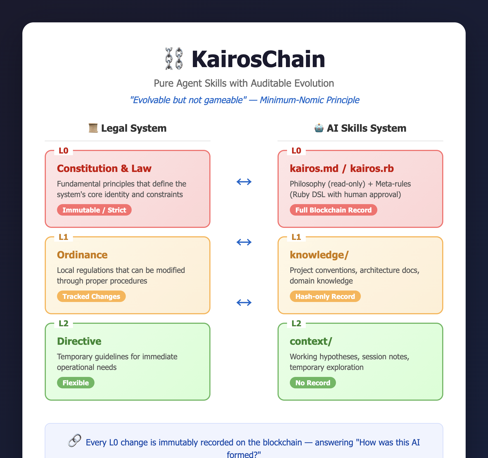

# KairosChain MCP Server

**A Meta Ledger for Recording AI Skill Evolution**

> 📖 [日本語版 README はこちら (Japanese README)](README_jp.md)

KairosChain is a Model Context Protocol (MCP) server that records the evolution of AI capabilities on a private blockchain. It combines Pure Skills design (Ruby DSL/AST) with immutable ledger technology, enabling AI agents to have auditable, evolvable, and self-referential skill definitions.

## Philosophy

### The Problem

The biggest black box in LLM/AI agents is:

> **The inability to explain how current capabilities were formed.**

- Prompts are volatile
- Tool call histories are fragmented
- Skill evolution (redefinition, synthesis, deletion) leaves no trace

As a result, AI becomes an entity whose **causal process cannot be verified by third parties**, even when it:
- Becomes more capable
- Changes behavior
- Becomes potentially dangerous

### The Solution: KairosChain

KairosChain addresses this by:

1. **Defining skills as executable structures** (Ruby DSL), not just documentation
2. **Recording every skill change** on an immutable blockchain
3. **Enabling self-reference** so AI can inspect its own capabilities
4. **Enforcing safe evolution** with approval workflows and immutability rules

KairosChain is not a platform, currency, or DAO. It is a **Meta Ledger** — an audit trail for capability evolution.

### Minimum-Nomic Principle

KairosChain implements **Minimum-Nomic** — a system where:

- Rules (skills) **can** be changed
- But **who**, **when**, **what**, and **how** they were changed is always recorded and cannot be erased

This avoids both extremes:
- ❌ Completely fixed rules (no adaptation)
- ❌ Unrestricted self-modification (chaos)

Instead, we achieve: **Evolvable but not gameable systems**.

## Architecture



*Figure: KairosChain's legal-system-inspired layered architecture for AI skill management*

### System Overview

```
┌─────────────────────────────────────────────────────────────────┐
│                    MCP Client (Cursor / Claude Code)            │
└───────────────────────────────┬─────────────────────────────────┘
                                │ STDIO (JSON-RPC)
                                ▼
┌─────────────────────────────────────────────────────────────────┐
│                    KairosChain MCP Server                        │
│  ┌──────────────┐ ┌──────────────┐ ┌──────────────────────────┐ │
│  │    Server    │ │   Protocol   │ │     Tool Registry        │ │
│  │  STDIO Loop  │ │  JSON-RPC    │ │  12+ Tools Available     │ │
│  └──────────────┘ └──────────────┘ └──────────────────────────┘ │
│                                                                  │
│  ┌──────────────────────────────────────────────────────────┐   │
│  │                    Skills Layer                           │   │
│  │  ┌────────────┐ ┌────────────┐ ┌────────────────────────┐│   │
│  │  │ kairos.rb  │ │ kairos.md  │ │    Kairos Module       ││   │
│  │  │ (DSL)      │ │ (Markdown) │ │  (Self-Reference)      ││   │
│  │  └────────────┘ └────────────┘ └────────────────────────┘│   │
│  └──────────────────────────────────────────────────────────┘   │
│                                                                  │
│  ┌──────────────────────────────────────────────────────────┐   │
│  │                   Blockchain Layer                        │   │
│  │  ┌────────────┐ ┌────────────┐ ┌────────────────────────┐│   │
│  │  │   Block    │ │   Chain    │ │     MerkleTree         ││   │
│  │  │ (SHA-256)  │ │ (JSON)     │ │  (Proof Generation)    ││   │
│  │  └────────────┘ └────────────┘ └────────────────────────┘│   │
│  └──────────────────────────────────────────────────────────┘   │
└─────────────────────────────────────────────────────────────────┘
```

## Layered Skills Architecture

KairosChain implements a **legal-system-inspired layered architecture** for knowledge management:

| Layer | Legal Analogy | Path | Blockchain Record | Mutability |
|-------|---------------|------|-------------------|------------|
| **L0-A** | Constitution | `skills/kairos.md` | - | Read-only |
| **L0-B** | Law | `skills/kairos.rb` | Full transaction | Human approval required |
| **L1** | Ordinance | `knowledge/` | Hash reference only | Lightweight constraints |
| **L2** | Directive | `context/` | None | Free modification |

### L0: Kairos Core (`skills/`)

The foundation of KairosChain. Contains meta-rules about self-modification.

- **kairos.md**: Philosophy and principles (immutable, read-only)
- **kairos.rb**: Meta-skills in Ruby DSL (modifiable with full blockchain record)

Only these meta-skills can be placed in L0:
- `core_safety`, `evolution_rules`, `layer_awareness`, `approval_workflow`, `self_inspection`, `chain_awareness`

> **Note: Skill-Tool Unification**  
> Skills in `kairos.rb` can also define MCP tools via the `tool` block. When `skill_tools_enabled: true` is set in config, these skills are automatically registered as MCP tools. This means **skills and tools are unified in L0-B** — you can add, modify, or remove tools by editing `kairos.rb` (subject to L0 constraints: human approval required, full blockchain record).

### L1: Knowledge Layer (`knowledge/`)

Project-specific universal knowledge in **Anthropic Skills format**.

```
knowledge/
└── skill_name/
    ├── skill_name.md       # YAML frontmatter + Markdown
    ├── scripts/            # Executable scripts (Python, Bash, Node)
    ├── assets/             # Templates, images, CSS
    └── references/         # Reference materials, datasets
```

Example `skill_name.md`:

```markdown
---
name: coding_rules
description: Project coding conventions
version: "1.0"
layer: L1
tags: [style, convention]
---

# Coding Rules

## Naming Conventions
- Class names: PascalCase
- Method names: snake_case
```

### L2: Context Layer (`context/`)

Temporary context for sessions. Same format as L1 but **no blockchain recording**.

```
context/
└── session_id/
    └── hypothesis/
        └── hypothesis.md
```

Use for:
- Working hypotheses
- Scratch notes
- Trial-and-error exploration

### Why Layered Architecture?

1. **Not all knowledge needs the same constraints** — temporary thoughts shouldn't require blockchain records
2. **Separation of concerns** — Kairos meta-rules vs. project knowledge vs. temporary context
3. **AI autonomy with accountability** — free exploration in L2, tracked changes in L1, strict control in L0

## Data Model: SkillStateTransition

Every skill change is recorded as a `SkillStateTransition`:

```ruby
{
  skill_id: String,        # Skill identifier
  prev_ast_hash: String,   # SHA-256 of previous AST
  next_ast_hash: String,   # SHA-256 of new AST
  diff_hash: String,       # SHA-256 of the diff
  actor: String,           # "Human" / "AI" / "System"
  agent_id: String,        # Kairos agent identifier
  timestamp: ISO8601,
  reason_ref: String       # Off-chain reason reference
}
```

## Setup

### Prerequisites

- Ruby 3.3+ (uses standard library only, no gems required for basic functionality)
- Claude Code CLI (`claude`) or Cursor IDE

### Installation

```bash
# Clone the repository
git clone https://github.com/masaomi/KairosChain_2026.git
cd KairosChain_2026/KairosChain_mcp_server

# Make executable
chmod +x bin/kairos_mcp_server

# Test basic execution
echo '{"jsonrpc":"2.0","id":1,"method":"initialize","params":{}}' | bin/kairos_mcp_server
```

### Optional: RAG (Semantic Search) Support

KairosChain supports optional semantic search using vector embeddings. This enables finding skills by meaning rather than exact keyword matches (e.g., searching "authentication" can find skills about "login" or "password").

**Without RAG gems:** Regex-based keyword search (default, no installation required)  
**With RAG gems:** Semantic vector search using sentence embeddings

#### Requirements

- C++ compiler (for native extensions)
- ~90MB disk space (for embedding model, downloaded on first use)

#### Installation

```bash
cd KairosChain_mcp_server

# Option 1: Using Bundler (recommended)
bundle install --with rag

# Option 2: Direct gem install
gem install hnswlib informers
```

#### Gems Used

| Gem | Version | Purpose |
|-----|---------|---------|
| `hnswlib` | ~> 0.9 | HNSW approximate nearest neighbor search |
| `informers` | ~> 1.0 | ONNX-based sentence embeddings |

#### Supported Layers

| Layer | Target | RAG Support | Index Path |
|-------|--------|-------------|------------|
| **L0** | `skills/kairos.rb` (meta-skills) | Yes | `storage/embeddings/skills/` |
| **L1** | `knowledge/` (project knowledge) | Yes | `storage/embeddings/knowledge/` |
| **L2** | `context/` (temporary context) | No | N/A (regex search only) |

L2 is excluded because temporary contexts are short-lived and typically few in number, making regex search sufficient.

#### Configuration

RAG settings in `skills/config.yml`:

```yaml
vector_search:
  enabled: true                                      # Enable if gems available
  model: "sentence-transformers/all-MiniLM-L6-v2"    # Embedding model
  dimension: 384                                     # Must match model
  index_path: "storage/embeddings"                   # Index storage path
  auto_index: true                                   # Auto-rebuild on changes
```

#### Verification

```bash
# Check if RAG is available
ruby -e "require 'hnswlib'; require 'informers'; puts 'RAG gems installed!'"

# Or test via MCP
echo '{"jsonrpc":"2.0","id":1,"method":"tools/call","params":{"name":"hello_world","arguments":{}}}' | bin/kairos_mcp_server
```

#### How It Works

```
┌─────────────────────────────────────────────────────────────┐
│                      Search Query                            │
└─────────────────────────────────────────────────────────────┘
                              │
                              ▼
                    ┌─────────────────────┐
                    │  VectorSearch.available?  │
                    └─────────────────────┘
                              │
              ┌───────────────┴───────────────┐
              │                               │
              ▼                               ▼
    ┌─────────────────┐             ┌─────────────────┐
    │ Semantic Search │             │ Fallback Search │
    │ (hnswlib +      │             │ (Regex-based)   │
    │  informers)     │             │                 │
    └─────────────────┘             └─────────────────┘
              │                               │
              └───────────────┬───────────────┘
                              ▼
                    ┌─────────────────┐
                    │  Search Results │
                    └─────────────────┘
```

---

## Client Configuration

### Claude Code Configuration (Detailed)

Claude Code is a CLI-based AI coding assistant.

#### Step 1: Verify Claude Code Installation

```bash
# Check if Claude Code is installed
claude --version

# If not installed, install from the official site
# https://docs.anthropic.com/claude-code
```

#### Step 2: Register the MCP Server

```bash
# Register KairosChain MCP server
claude mcp add kairos-chain ruby /path/to/KairosChain_mcp_server/bin/kairos_mcp_server

```

#### Step 3: Verify Registration

```bash
# List registered MCP servers
claude mcp list

# You should see kairos-chain in the list
```

#### Step 4: Check Configuration File (Optional)

The following configuration is added to `~/.claude.json`:

```json
{
  "mcpServers": {
    "kairos-chain": {
      "command": "ruby",
      "args": ["/path/to/KairosChain_mcp_server/bin/kairos_mcp_server"],
      "env": {}
    }
  }
}
```

#### Manual Configuration (Advanced)

To edit the configuration file directly:

```bash
# Open the configuration file
vim ~/.claude.json

# Or use VS Code
code ~/.claude.json
```

### Cursor IDE Configuration (Detailed)

Cursor is a VS Code-based AI coding IDE.

#### Option A: Via GUI (Recommended)

1. Open **Cursor Settings** (Cmd/Ctrl + ,)
2. Navigate to **Tools & MCP**
3. Click **New MCP Server**
4. Enter the server details:
   - Name: `kairos-chain`
   - Command: `ruby`
   - Args: `/path/to/KairosChain_mcp_server/bin/kairos_mcp_server`

#### Option B: Via Configuration File

#### Step 1: Locate the Configuration File

```bash
# macOS / Linux
~/.cursor/mcp.json

# Windows
%USERPROFILE%\.cursor\mcp.json
```

#### Step 2: Create/Edit the Configuration File

```bash
# Create directory if it doesn't exist
mkdir -p ~/.cursor

# Edit the configuration file
vim ~/.cursor/mcp.json
```

#### Step 3: Add the MCP Server

```json
{
  "mcpServers": {
    "kairos-chain": {
      "command": "ruby",
      "args": ["/path/to/KairosChain_mcp_server/bin/kairos_mcp_server"],
      "env": {}
    }
  }
}
```

**For multiple MCP servers:**

```json
{
  "mcpServers": {
    "kairos-chain": {
      "command": "ruby",
      "args": ["/Users/yourname/KairosChain_mcp_server/bin/kairos_mcp_server"],
      "env": {}
    },
    "sushi-mcp-server": {
      "command": "ruby",
      "args": ["/path/to/SUSHI_self_maintenance_mcp_server/bin/sushi_mcp_server"],
      "env": {}
    }
  }
}
```

#### Step 4: Restart Cursor

After saving the configuration, **you must completely restart Cursor**.

#### Step 5: Verify MCP Server Connection

1. Open Cursor
2. Click the "MCP" icon in the top right (or search "MCP" in the command palette)
3. Verify that `kairos-chain` appears in the list with a green status indicator

---

## Testing the Setup

### 1. Basic Command Line Tests

#### Initialize Test

```bash
cd /path/to/KairosChain_mcp_server

# Send initialize request
echo '{"jsonrpc":"2.0","id":1,"method":"initialize","params":{}}' | bin/kairos_mcp_server

# Expected response (excerpt):
# {"jsonrpc":"2.0","id":1,"result":{"protocolVersion":"2024-11-05","capabilities":...}}
```

#### Tools List Test

```bash
# Get list of available tools
echo '{"jsonrpc":"2.0","id":2,"method":"tools/list","params":{}}' | bin/kairos_mcp_server

# If you have jq, display only tool names
echo '{"jsonrpc":"2.0","id":2,"method":"tools/list","params":{}}' | bin/kairos_mcp_server 2>/dev/null | jq '.result.tools[].name'
```

#### Hello World Test

```bash
# Call the hello_world tool
echo '{"jsonrpc":"2.0","id":3,"method":"tools/call","params":{"name":"hello_world","arguments":{}}}' | bin/kairos_mcp_server 2>/dev/null | jq -r '.result.content[0].text'

# Output: Hello from KairosChain MCP Server!
```

### 2. Skills Tools Test

```bash
# Get skills list
echo '{"jsonrpc":"2.0","id":4,"method":"tools/call","params":{"name":"skills_dsl_list","arguments":{}}}' | bin/kairos_mcp_server 2>/dev/null | jq -r '.result.content[0].text'

# Get a specific skill
echo '{"jsonrpc":"2.0","id":5,"method":"tools/call","params":{"name":"skills_dsl_get","arguments":{"skill_id":"core_safety"}}}' | bin/kairos_mcp_server 2>/dev/null | jq -r '.result.content[0].text'
```

### 3. Blockchain Tools Test

```bash
# Check blockchain status
echo '{"jsonrpc":"2.0","id":6,"method":"tools/call","params":{"name":"chain_status","arguments":{}}}' | bin/kairos_mcp_server 2>/dev/null | jq -r '.result.content[0].text'

# Verify chain integrity
echo '{"jsonrpc":"2.0","id":7,"method":"tools/call","params":{"name":"chain_verify","arguments":{}}}' | bin/kairos_mcp_server 2>/dev/null | jq -r '.result.content[0].text'
```

### 4. Testing with Claude Code

```bash
# Launch Claude Code
claude

# Try these prompts in Claude Code:
# "List the available KairosChain tools"
# "Run skills_dsl_list"
# "Check chain_status"
```

### 5. Testing with Cursor

1. Open your project in Cursor
2. Open the chat panel (Cmd/Ctrl + L)
3. Try these prompts:
   - "List all KairosChain skills"
   - "Check the blockchain status"
   - "Show me the core_safety skill content"

### Troubleshooting

#### Server Doesn't Start

```bash
# Check Ruby version
ruby --version  # Requires 3.3+

# Check for syntax errors
ruby -c bin/kairos_mcp_server

# Verify executable permission
ls -la bin/kairos_mcp_server
chmod +x bin/kairos_mcp_server
```

#### JSON-RPC Errors

```bash
# Check stderr for error messages
echo '{"jsonrpc":"2.0","id":1,"method":"initialize","params":{}}' | bin/kairos_mcp_server

# Run without suppressing stderr (remove 2>/dev/null)
```

#### Cursor Connection Issues

1. Verify the path in `~/.cursor/mcp.json` is an absolute path
2. Check JSON syntax (missing/extra commas, etc.)
3. Completely quit and restart Cursor

---

## Usage Tips

### Basic Usage

#### 1. Working with Skills

KairosChain manages AI capability definitions as "Skills".

```
# In Cursor / Claude Code:
"List all current skills"
"Show me the core_safety skill content"
"Use self_introspection to check Kairos state"
```

#### 2. Blockchain Recording

AI evolution processes are recorded on the blockchain.

```
# Checking records
"Show me the chain_history"
"Verify chain integrity with chain_verify"
```

### Practical Usage Patterns

#### Pattern 1: Starting a Development Session

```
# Session startup checklist
1. "Check blockchain status with chain_status"
2. "List available skills with skills_dsl_list"
3. "Verify chain integrity with chain_verify"
```

#### Pattern 2: Skill Evolution (Human Approval Required)

```yaml
# Enable evolution in config/safety.yml
evolution_enabled: true
require_human_approval: true
```

```
# Evolution workflow:
1. "Propose a change to my_skill using skills_evolve"
2. [Human] Review and approve the proposal
3. "Apply the change with skills_evolve (approved=true)"
4. "Verify the record with chain_history"
```

#### Pattern 3: Auditing and Traceability

```
# Track specific change history
"Show recent skill changes with chain_history"
"Get details of a specific block"

# Periodic integrity verification
"Verify the entire chain with chain_verify"
```

### Best Practices

#### 1. Be Cautious with Evolution

- Keep `evolution_enabled: false` as the default
- Start evolution sessions explicitly and disable after completion
- Route all changes through human approval

#### 2. Regular Verification

```bash
# Run daily/weekly
echo '{"jsonrpc":"2.0","id":1,"method":"tools/call","params":{"name":"chain_verify","arguments":{}}}' | bin/kairos_mcp_server
```

#### 3. Backups

```bash
# Regularly backup storage/blockchain.json
cp storage/blockchain.json storage/backups/blockchain_$(date +%Y%m%d).json

# Also backup skill versions
cp -r skills/versions skills/backups/versions_$(date +%Y%m%d)
```

#### 4. Sharing Across Multiple AI Agents

Share the same `blockchain.json` to synchronize evolution history across multiple AI agents.

```json
// In ~/.cursor/mcp.json or ~/.claude.json
{
  "mcpServers": {
    "kairos-chain": {
      "command": "ruby",
      "args": ["/shared/path/KairosChain_mcp_server/bin/kairos_mcp_server"],
      "env": {
        "KAIROS_STORAGE": "/shared/storage"
      }
    }
  }
}
```

### Common Commands Reference

| Task | Cursor/Claude Code Prompt |
|------|---------------------------|
| List Skills | "Run skills_dsl_list" |
| Get Specific Skill | "Get core_safety with skills_dsl_get" |
| Chain Status | "Check chain_status" |
| View History | "Show chain_history" |
| Verify Integrity | "Run chain_verify" |
| Record Data | "Record a log with chain_record" |

### Security Considerations

1. **Safe Evolution Settings**
   - Keep `require_human_approval: true`
   - Only set `evolution_enabled: true` when needed

2. **Access Control**
   - Restrict allowed paths in `config/safety.yml`
   - Add sensitive files to the blocklist

3. **Audit Logging**
   - All operations are recorded in `action_log`
   - Review logs regularly

## Available Tools (21 core + skill-tools)

The base installation provides 21 tools. Additional tools can be defined via `tool` blocks in `kairos.rb` when `skill_tools_enabled: true`.

### L0-A: Skills Tools (Markdown) - Read-only

| Tool | Description |
|------|-------------|
| `skills_list` | List all skills sections from kairos.md |
| `skills_get` | Get specific section by ID |

### L0-B: Skills Tools (DSL) - Full Blockchain Record

| Tool | Description |
|------|-------------|
| `skills_dsl_list` | List all skills from kairos.rb |
| `skills_dsl_get` | Get skill definition by ID |
| `skills_evolve` | Propose/apply skill changes |
| `skills_rollback` | Manage version snapshots |

> **Skill-defined tools**: When `skill_tools_enabled: true`, skills with `tool` blocks in `kairos.rb` are also registered here as MCP tools.

### L1: Knowledge Tools - Hash Reference Record

| Tool | Description |
|------|-------------|
| `knowledge_list` | List all knowledge skills |
| `knowledge_get` | Get knowledge content by name |
| `knowledge_update` | Create/update/delete knowledge (hash recorded) |
| `knowledge_scripts` | List scripts in a knowledge skill |
| `knowledge_assets` | List assets in a knowledge skill |

### L2: Context Tools - No Blockchain Record

| Tool | Description |
|------|-------------|
| `context_sessions` | List all active sessions |
| `context_list` | List contexts in a session |
| `context_get` | Get context content |
| `context_save` | Save context (free modification) |
| `context_create_subdir` | Create scripts/assets/references subdir |

### Blockchain Tools

| Tool | Description |
|------|-------------|
| `chain_status` | Get blockchain status |
| `chain_record` | Record data to blockchain |
| `chain_verify` | Verify chain integrity |
| `chain_history` | View block history |

## Usage Examples

### List Available Skills

```bash
echo '{"jsonrpc":"2.0","id":1,"method":"tools/call","params":{"name":"skills_dsl_list","arguments":{}}}' | bin/kairos_mcp_server
```

### Check Blockchain Status

```bash
echo '{"jsonrpc":"2.0","id":1,"method":"tools/call","params":{"name":"chain_status","arguments":{}}}' | bin/kairos_mcp_server
```

### Record a Skill Transition

```bash
echo '{"jsonrpc":"2.0","id":1,"method":"tools/call","params":{"name":"chain_record","arguments":{"logs":["Skill X modified","Reason: improved accuracy"]}}}' | bin/kairos_mcp_server
```

## Self-Evolution Workflow

KairosChain supports **Safe Self-Evolution**:

1. **Enable Evolution** (in `skills/config.yml`):
   ```yaml
   evolution_enabled: true
   require_human_approval: true
   ```

2. **AI Proposes Change**:
   ```bash
   skills_evolve command=propose skill_id=my_skill definition="..."
   ```

3. **Human Reviews and Approves**:
   ```bash
   skills_evolve command=apply skill_id=my_skill definition="..." approved=true
   ```

4. **Change is Applied and Recorded**:
   - Snapshot created in `skills/versions/`
   - Transition recorded on blockchain
   - `Kairos.reload!` updates in-memory state

5. **Verification**:
   ```bash
   chain_verify  # Confirms integrity
   chain_history # Shows the transition record
   ```

## Pure Skills Design

### skills.md vs skills.rb

| Aspect | skills.md (Markdown) | skills.rb (Ruby DSL) |
|--------|---------------------|---------------------|
| Nature | Description | Definition |
| Executability | ❌ Cannot be evaluated | ✅ Parseable, validatable |
| Self-Reference | None | Via `Kairos` module |
| Auditability | Git commits only | Native (AST-based diff) |
| AI Role | Reader | Part of the structure |

### Example Skill Definition

```ruby
skill :core_safety do
  version "1.0"
  title "Core Safety Rules"
  
  guarantees do
    immutable
    always_enforced
  end
  
  evolve do
    deny :all  # Cannot be modified
  end
  
  content <<~MD
    ## Core Safety Invariants
    1. Evolution requires explicit enablement
    2. Human approval required by default
    3. All changes create blockchain records
  MD
end
```

### Self-Referential Introspection

```ruby
skill :self_inspection do
  version "1.0"
  
  behavior do
    Kairos.skills.map do |skill|
      {
        id: skill.id,
        version: skill.version,
        can_evolve: skill.can_evolve?(:content)
      }
    end
  end
end
```

## Directory Structure

```
KairosChain_mcp_server/
├── bin/
│   └── kairos_mcp_server         # Executable
├── config/
│   └── safety.yml                # Security settings
├── lib/
│   └── kairos_mcp/
│       ├── server.rb             # STDIO server
│       ├── protocol.rb           # JSON-RPC handler
│       ├── kairos.rb             # Self-reference module
│       ├── safe_evolver.rb       # Evolution with safety
│       ├── layer_registry.rb     # Layered architecture management
│       ├── anthropic_skill_parser.rb  # YAML frontmatter + MD parser
│       ├── knowledge_provider.rb # L1 knowledge management
│       ├── context_manager.rb    # L2 context management
│       ├── kairos_chain/         # Blockchain implementation
│       │   ├── block.rb
│       │   ├── chain.rb
│       │   ├── merkle_tree.rb
│       │   └── skill_transition.rb
│       └── tools/                # MCP tools (21 core)
│           ├── skills_*.rb       # L0 tools
│           ├── knowledge_*.rb    # L1 tools
│           └── context_*.rb      # L2 tools
├── skills/                       # L0: Kairos Core
│   ├── kairos.md                 # L0-A: Philosophy (read-only)
│   ├── kairos.rb                 # L0-B: Meta-rules (Ruby DSL)
│   ├── config.yml                # Layer & evolution settings
│   └── versions/                 # Version snapshots
├── knowledge/                    # L1: Project Knowledge (Anthropic format)
│   └── example_knowledge/
│       ├── example_knowledge.md  # YAML frontmatter + Markdown
│       ├── scripts/              # Executable scripts
│       ├── assets/               # Templates, resources
│       └── references/           # Reference materials
├── context/                      # L2: Temporary Context (Anthropic format)
│   └── session_xxx/
│       └── hypothesis/
│           └── hypothesis.md
├── storage/
│   ├── blockchain.json           # Chain data
│   └── off_chain/                # AST diffs, reasons
├── test_local.rb                 # Local test script
└── README.md
```

## Future Roadmap

1. **Ethereum Anchor**: Periodic hash anchoring to public chain
2. **Multi-Agent Support**: Track multiple AI agents via `agent_id`
3. **Zero-Knowledge Proofs**: Privacy-preserving verification
4. **Web Dashboard**: Visualize skill evolution history
5. **Team Governance**: Voting system for L0 changes (see FAQ)

---

## FAQ

### Q: Can LLMs automatically modify L1/L2?

**A:** Yes, LLMs can modify L1/L2 autonomously (or upon user request) using MCP tools.

| Layer | LLM Modification | Conditions |
|-------|------------------|------------|
| **L0** (kairos.rb) | Possible but strict | `evolution_enabled: true` + `approved: true` (human approval) + blockchain record |
| **L1** (knowledge/) | Possible | Hash-only blockchain record, no human approval required |
| **L2** (context/) | Free | No record, no approval required |

Note: `kairos.md` is read-only and cannot be modified by LLMs.

**Usage Examples:**
- L2: Temporarily save hypotheses during research with `context_save`
- L1: Persist project coding conventions with `knowledge_update`
- L0: Propose meta-skill changes with `skills_evolve` (human approval required)

---

### Q: Is API extension needed for team usage?

**A:** The current implementation is limited to local use via stdio. For team usage, the following options are available:

| Method | Additional Implementation | Suitable Scale |
|--------|---------------------------|----------------|
| **Git sharing** | Not required | Small teams (2-5 people) |
| **HTTP API** | Required | Medium teams (5-20 people) |
| **MCP over SSE** | Required | When remote connection is needed |

**Git sharing (simplest):**
```
# Manage knowledge/, skills/, data/blockchain.json with Git
# Each member runs the MCP server locally
# Changes are synced via Git
```

**When HTTP API is needed:**
- Real-time synchronization required
- Authentication/authorization required
- Conflict resolution for concurrent edits required

---

### Q: Is a voting system needed for changes to kairos.rb or kairos.md in team settings?

**A:** It depends on team size and requirements.

**Current implementation (single approver model):**
```yaml
require_human_approval: true  # One person's approval is sufficient
```

**Features that may be needed for team operations:**

| Feature | L0 | L1 | L2 |
|---------|----|----|----| 
| Voting system | Recommended | Optional | Not needed |
| Quorum | Recommended | - | - |
| Proposal period | Recommended | - | - |
| Veto power | Depends | - | - |

**Tools needed in the future (not implemented):**
```
governance_propose    - Create change proposals
governance_vote       - Vote on proposals (approve/reject/abstain)
governance_status     - Check proposal voting status
governance_execute    - Execute proposals that exceed threshold
```

**Special nature of kairos.md:**

Since `kairos.md` corresponds to a "constitution," consensus building outside the system (GitHub Discussion, etc.) is recommended:

1. Propose via GitHub Issue / Discussion
2. Offline discussion with the entire team
3. Reach consensus by unanimity (or supermajority)
4. Manually edit and commit the file

---

### Q: How do I run local tests?

**A:** Run tests with the following commands:

```bash
cd KairosChain_mcp_server
ruby test_local.rb
```

Test coverage:
- Layer Registry operation verification
- List of 21 core MCP tools
- L1 Knowledge read/write
- L2 Context read/write
- L0 Skills DSL (6 skills) loading

After testing, artifacts (`context/test_session`) are created. Delete if not needed:
```bash
rm -rf context/test_session
```

---

### Q: What meta-skills are included in kairos.rb?

**A:** Currently 6 meta-skills are defined:

| Skill | Description | Modifiability |
|-------|-------------|---------------|
| `core_safety` | Safety foundation | Not modifiable (`deny :all`) |
| `evolution_rules` | Evolution rules definition | Content only |
| `layer_awareness` | Layer structure awareness | Content only |
| `approval_workflow` | Approval workflow | Content only |
| `self_inspection` | Self-inspection capability | Content only |
| `chain_awareness` | Blockchain awareness | Content only |

See `skills/kairos.rb` for details.

---

### Q: How does KairosChain decide when to evolve its own skills? Is there a meta-skill for this?

**A:** **KairosChain intentionally does NOT include logic for deciding "when to evolve."** This decision is delegated to the human side (or the AI client interacting with humans).

**Current design responsibilities:**

| Responsibility | Owner | Details |
|----------------|-------|---------|
| **Evolution judgment (when/what)** | Human / AI client | Outside KairosChain |
| **Evolution constraints (allow/deny)** | KairosChain | Validated by internal rules |
| **Evolution approval** | Human | Explicit `approved: true` |
| **Evolution recording** | KairosChain | Automatically recorded on blockchain |

**What is already implemented:**
- ✅ Evolution constraints (`SafeEvolver`)
- ✅ Workflow (propose → review → apply)
- ✅ Layer structure (L0/L1/L2)
- ✅ 6 meta-skills definition

**What is NOT implemented (by design):**
- ❌ "When to evolve" decision logic
- ❌ Self-detection of capability gaps
- ❌ Recognition of learning opportunities
- ❌ Evolution trigger conditions

**Design rationale:**

This is intentional. From `kairos.md` (PHILOSOPHY-020 Minimum-Nomic):

| Approach | Problem |
|----------|---------|
| Completely fixed rules | No adaptation, system becomes obsolete |
| **Unrestricted self-modification** | **Chaos, no accountability** |

To avoid "unrestricted self-modification," KairosChain intentionally delegates evolution triggers to external actors. KairosChain serves as a **gatekeeper** and **recorder**, not an autonomous self-modifier.

**Future extensibility:**

If you want to add a meta-skill for "when to evolve," you could define something like:

```ruby
skill :evolution_trigger do
  version "1.0"
  title "Evolution Trigger Logic"
  
  evolve do
    allow :content      # Trigger conditions can be modified
    deny :behavior      # Decision logic itself is fixed
  end
  
  content <<~MD
    ## Evolution Trigger Conditions
    
    1. When the same error pattern occurs 3+ times
    2. When user explicitly says "remember this"
    3. When new domain knowledge is provided
    → Propose saving to L1
  MD
end
```

However, even with such a meta-skill, **final approval should remain with humans**. This is the core of KairosChain's safety design.

---

### Q: What is Skill-Tool Unification? Can I add MCP tools without editing Ruby files?

**A:** Yes! Skills in `kairos.rb` can now define MCP tools via the `tool` block. This unifies skills and tools in L0-B.

**How it works:**

```ruby
# In kairos.rb
skill :my_custom_tool do
  version "1.0"
  title "My Custom Tool"
  
  # Traditional behavior (for skill introspection)
  behavior do
    { capability: "..." }
  end
  
  # Tool definition (exposed as MCP tool)
  tool do
    name "my_custom_tool"
    description "Does something useful"
    
    input do
      property :arg, type: "string", description: "Argument"
      required :arg
    end
    
    execute do |args|
      # Tool implementation
      { result: process(args["arg"]) }
    end
  end
end
```

**Enable in config:**

```yaml
# skills/config.yml
skill_tools_enabled: true   # Default: false
```

**Key points:**
- Default is **disabled** (conservative)
- Adding/modifying tools requires editing `kairos.rb` (L0 constraints apply)
- Changes require human approval (`approved: true`)
- All changes are recorded on blockchain
- Aligns with Minimum-Nomic: "can change, but recorded"

**Why is this so strict?**

L0 (`kairos.rb`) is intentionally locked with **triple protection**:

| Protection | Setting | Effect |
|------------|---------|--------|
| 1 | `evolution_enabled: false` | Blocks any kairos.rb changes |
| 2 | `require_human_approval: true` | Requires explicit human approval |
| 3 | `skill_tools_enabled: false` | Skills not registered as tools |

**Important:** There is no MCP tool to modify `config.yml`. Even if an LLM is asked to "change these settings," it cannot — humans must manually edit `config.yml`.

This is by design: L0 corresponds to "constitution/law" in the legal analogy. It should rarely change. For frequent tool additions, consider:

- **Current limitation**: Only L0 supports `tool` blocks
- **Future possibility**: L1 tool definition support (lighter constraints, no human approval, hash-only recording)

For most use cases, **L0 tools should not need frequent changes**. The strict lock ensures system integrity.

---

### Q: Should KairosChain proactively recommend skill creation to the LLM?

**A:** **No. KairosChain should focus on "recording and constraining," not "recommending when to learn."** The logic for recommending skill creation should be delegated to the LLM/AI agent side (e.g., Cursor Rules, system_prompt).

**Why this separation?**

| Aspect | Implemented in KairosChain | Delegated to LLM/Agent |
|--------|---------------------------|------------------------|
| **Minimum-Nomic Principle** | "Changes should be rare and high-cost" | Agent decides when learning is valuable |
| **Separation of Concerns** | KairosChain = gatekeeper & recorder | LLM = decision-maker for learning triggers |
| **Customizability** | Same constraints for all users | Each user can configure different agent behaviors |
| **Prompt Injection Risk** | Recommendation logic could be attacked | Defense can be handled at agent level |

**KairosChain's role:**
- ✅ Record skill changes immutably
- ✅ Enforce evolution constraints (approval, layer rules)
- ✅ Provide tools for skill management
- ❌ Decide "when" or "what" to learn

**Recommended approach for proactive skill recommendations:**

Configure your AI agent (Cursor Rules, Claude system_prompt, etc.) to include:

```markdown
# Agent Learning Rules

## When to Recommend Skill Creation
- After solving a problem that required multiple iterations
- When the user says "I always forget..." or "This is a common pattern"
- When similar code patterns are generated repeatedly

## Recommendation Format
"I noticed [pattern]. Would you like me to capture this as a KairosChain skill?"

## Then use KairosChain tools:
- L2: `context_save` for temporary hypotheses
- L1: `knowledge_update` for project knowledge (hash-only record)
- L0: `skills_evolve` for meta-skills (requires human approval)
```

This keeps KairosChain as a **neutral infrastructure** while allowing each team/user to define their own learning policies at the agent level.

---

## License

See [LICENSE](../LICENSE) file.

---

**Version**: 0.3.0  
**Last Updated**: 2026-01-19

> *"KairosChain answers not 'Is this result correct?' but 'How was this intelligence formed?'"*
