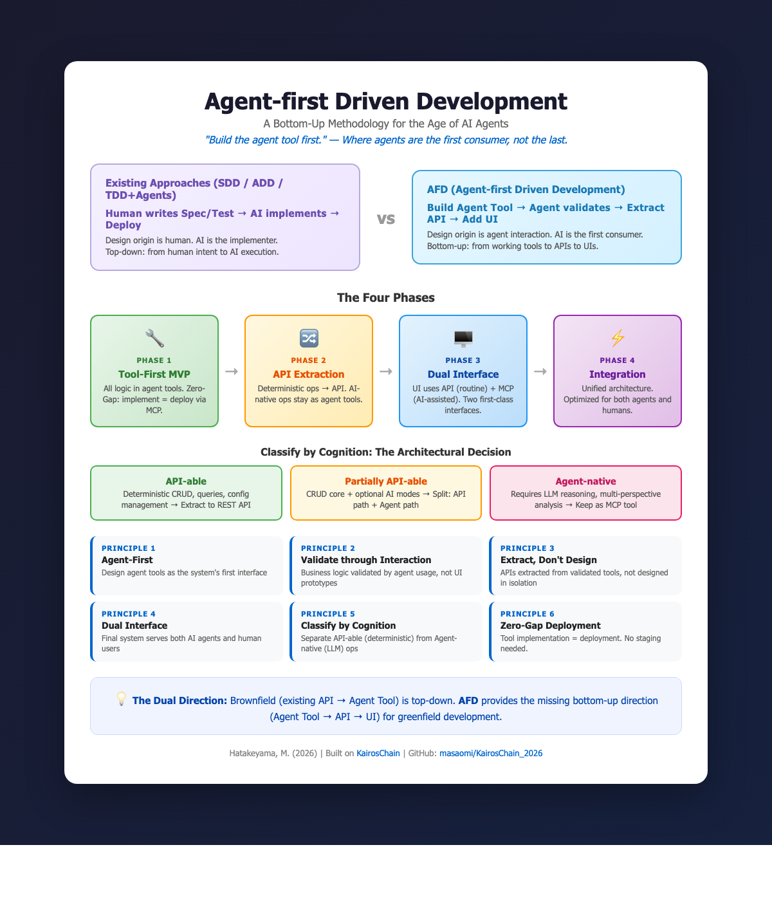

# Agent-first Driven Development: AI エージェント時代のソフトウェア構築のためのボトムアップ方法論

**畠山 正臣 (Masaomi Hatakeyama)**  
Genomics on Blockchain  
2026年2月14日

---

## 概要 (Abstract)

AIコーディングアシスタントとエージェントフレームワークの急速な普及により、非構造的なバイブコーディングからSpec-Driven Development（SDD）やAgent-Driven Development（ADD）まで、複数の開発方法論が競合している。しかし、これらのアプローチは共通の前提を共有している：人間が仕様、テスト、または指示を書き、AIエージェントがそれを実装する。設計の起点は依然として人間中心である。本論文はAgent-first Driven Development（AFD）を提案する。AFDはエージェントツールをシステム設計の主要インターフェースおよびソースオブトゥルースとして扱うボトムアップ方法論である。AFDでは、開発者はまずドメインロジックをエージェントツールとして実装し、エージェントとのインタラクションを通じて検証し、決定論的操作をバックエンドAPIに抽出し、最後に人間向けUIを追加する。これによりAIエージェントと人間ユーザーの双方に対応するデュアルインターフェースアーキテクチャが生まれる。AFDは6つの原則を導入し、その中にはZero-Gap Deployment（ツール実装が即座にデプロイとなる）とClassify by Cognition（API化可能な操作とエージェント固有の操作の分離）が含まれる。本論文ではAI時代の開発方法論の包括的レビューの中でAFDを位置づけ、監査可能なAIスキル進化のためのMCPベースのメタ台帳であるKairosChainを通じてその適用を実証する。AFDは方法論的ギャップを埋める：業界が既存APIをエージェントツールに変換する（トップダウン）方向に注力する中、AFDはグリーンフィールド開発のための欠落したボトムアップ方向を提供する。

**キーワード:** エージェントファースト開発、MCP、ツール駆動設計、API抽出、デュアルインターフェースアーキテクチャ、ソフトウェア方法論、KairosChain

---



*図1: Agent-first Driven Development（AFD）概要。既存アプローチ（SDD、ADD、TDD+Agents）は人間の仕様からAI実装へとトップダウンに流れる。AFDはこれを反転させる：エージェントツールを最初に構築し、インタラクションで検証した後、APIとUIに段階的に抽出する。*

---

## 1. はじめに

ソフトウェア開発方法論は歴史的に、開発プロセスの中心となる主要な成果物を再定義することで進化してきた。オブジェクト指向プログラミング（OOP）はオブジェクトを中心に据えた。テスト駆動開発（TDD）はテストを最初に書く成果物とした [1]。振る舞い駆動開発（BDD）はユーザーストーリーと受け入れ基準を前面に出した。ドメイン駆動設計（DDD）は境界づけられたコンテキストとユビキタス言語を中心にシステムを構成した [2]。各パラダイムシフトは本質的に、新しい「最初に作るもの」の宣言であった。

大規模言語モデル（LLM）エージェントの開発パートナーとしての登場は、次のそのような宣言の緊急の必要性を生み出した。2025年、Andrej Karpathyは「バイブコーディング」という言葉を作り、AIとの会話的で即興的なコード生成を表現した [3]。バイブコーディングは参入障壁を下げたものの、研究はその限界を速やかに明らかにした：非構造的なAIコード生成は複雑なコードベースでの生産性に重大な課題をもたらし、生成されたコードは各修正が新たなバグを生むエントロピーループに苦しんだ [4, 5]。構造化されたAI開発方法論の必要性が明白になった。

いくつかの対応が現れた。Spec-Driven Development（SDD）は仕様を主要な成果物として書き、AIが仕様からコードを生成することを提案した [6, 7]。Agent-Driven Development（ADD）は人間を「エディター」として位置づけ、AI実装者を監督する [8]。AI-Native Software Engineering（SE 3.0）は意図中心の会話型開発を構想した [9]。TDFlowはTDDサイクルとエージェンティックワークフローを組み合わせた [10]。

しかし、これらのアプローチは根本的な前提を共有している：**設計の起点は人間にある**。人間が仕様を書き（SDD）、編集上の方向性を提供し（ADD）、意図を表現し（SE 3.0）、テストを書く（TDFlow）。AIは*実装者*として位置づけられている——より有能なペアプログラマーだが、依然として人間起点の設計に応答している。

本論文は異なる出発点を提案する。**Agent-first Driven Development（AFD）** はAIエージェントをシステムの*最後の実装者*ではなく、*最初の消費者*として扱う。開発プロセスはドメインロジックをエージェントツール——AIエージェントが呼び出す構造化されたインターフェース——として実装することから始まり、検証済みのツールインタラクションからAPIとUIを段階的に抽出する。エージェントは実装者ではない。エージェントは最初のユーザーである。

この反転は単に哲学的なものではない。具体的なアーキテクチャ上の帰結がある：APIは孤立した設計からではなく、経験的に検証されたツール使用パターンから抽出される。最終システムはエージェントと人間の双方のインターフェースを自然にサポートする。操作はその認知的要件（決定論的 vs AI依存）によって分類され、新しいアーキテクチャパターンが生まれる。

本論文の貢献は3点である：

1. **AI時代の開発方法論（2025–2026年）の体系的レビュー**。共有されたトップダウンの前提とAFDが対処するギャップの特定。
2. **AFD方法論**。6つの原則、4フェーズのワークフロー、およびアーキテクチャ判断のための認知的分類パターンで構成。
3. **ケーススタディ**。KairosChain [11]（MCPベースのメタ台帳、20以上のエージェントツールが段階的なAPIおよびUI抽出の基盤）を通じたAFDの実証。

---

## 2. 関連研究：AI時代の開発方法論

本セクションでは、AIエージェントがソフトウェア開発に不可欠になったことに対応して出現した主要な開発方法論をレビューする。非構造的から高度に構造化されたアプローチまでのスペクトラムに沿って整理し、共通パターンを特定する。

### 2.1 非構造的アプローチ：バイブコーディングとシグナルコーディング

Karpathy [3] は2025年2月に「バイブコーディング」を、AIエージェントに依存して反復的なプロンプティングを通じてコードを生成する会話型AIプログラミングパラダイムとして紹介した。速度とアプリケーションの結果をコード品質よりも優先する。迅速なプロトタイピングには効果的だったが、実証研究は重大な限界を明らかにした。Ge ら [4] はバイブコーディングの全体像を調査し、不明確な仕様要件、デバッグの困難さ、コラボレーションの困難さを含む課題を文書化した。業界分析では、非構造的なAIコード生成に依存する場合、複雑なコードベースでの開発者の生産性が大幅に低下し、タスクあたりのコード量が大幅に増加する可能性があることが報告された [5]。

「エントロピーループ」問題は特に深刻であった：初期の急速な進捗が脆弱で一貫性のないコードベースに変わり、各修正が新たなバグを導入する [5]。これがSignal Coding [12] につながった。Signal CodingはAIの迅速な反復に構造化された開発プラクティス（コード構造、パターン、テスト）を組み合わせてAIエージェントのパフォーマンスを向上させることを提案した。改善ではあったが、Signal Codingは根本的に新しいパラダイムというよりもバイブコーディングの改良にとどまる。

### 2.2 Spec-Driven Development (SDD)

Spec-Driven Developmentは、より規律あるの代替手段として登場し、コードの前に詳細な仕様を書くことで従来の開発を逆転させた。Fowler [6] は3つの成熟レベルを探求した：*spec-first*（仕様が初期開発を導き、その後破棄される）、*spec-anchored*（仕様が継続的な進化のために存続する）、*spec-as-source*（人間は仕様のみを編集し、AIがすべてのコードを生成・保守する）。GitHubのSpec Kit [7]、Kiro、Tesslがこのアプローチのアクティブな実装である。

マルチエージェントシステムでSDDを採用したエンタープライズチームは、タスク完了時間の34.2%短縮と、40〜60%のコーディネーションオーバーヘッドの排除を報告した [13]。SDDは仕様を実行可能な設計図として扱い、AIエージェントに明確な指示を提供することで、バイブコーディングの混沌に対処する。

しかし、SDDの核心的な前提は、**人間が仕様を書き、AIがそれを実装する**ことである。仕様がソースオブトゥルースであり、設計の方向は人間の意図からAIの実行へと流れる。

### 2.3 Agent-Driven Development (ADD)

Jansen [8] は、AIエージェントと人間の開発者が定義されたプロセスを通じて協力する構造化された方法論としてAgent-Driven Developmentを提案した。「エディター」と呼ばれる人間が方向性、ドメイン専門知識、批判的思考を提供し、エージェントが実装、ドキュメンテーション、テスト、バージョニングを処理する。Jansenは「信頼は前提条件ではない。プロセスの産物である」と強調した——強力なDevOpsプラクティス（Infrastructure as Code、CI/CD、自動テスト）がエージェントの運用を可能にする安全網として機能する。

注目すべきことに、Jansenは後にADDとSDDの概念的収束を認め、2025年11月に「これは今ではspec-driven developmentとして知られている」と書いた [8, コメント]。この収束は、ADDとSDDが同じ根本的な設計空間を占めていることを明らかにしている：人間が設計し、AIが実装する。

### 2.4 AI-Native Software Engineering (SE 3.0)

Hassan ら [9] は、AIシステムがタスク駆動型コパイロットを超えて、ソフトウェアエンジニアリングの原則について推論できるインテリジェントな協力者に進化する、意図中心の会話型開発のビジョンとしてSE 3.0を提案した。このアカデミックなビジョンペーパーは、AI固有のバージョン管理、ソースコードとしてのプロンプト、AI固有のIDEを含むインフラストラクチャの変更を予見した。

DORA 2025レポート [14] は実証的な基盤を提供し、AIが主に増幅器として機能すること——高パフォーマンス組織の強みと苦戦する組織の機能不全の双方を拡大すること——を発見した。Andreessen Horowitz [15] はAI時代の9つの新興開発者パターンを特定し、その中にModel Context Protocol（MCP）をより深いAI統合へのステップとして含めた。

SE 3.0は説得力のあるビジョンを提供する一方、具体的な開発プロセスや方法論を規定していない。

### 2.5 エージェンティックワークフローを伴うTDD

TDDとAIエージェントの統合は有望な結果を生んだ。TDFlow [10]——テスト駆動エージェンティックワークフロー——は、ソフトウェア修復を4つのサブエージェントコンポーネント（パッチ提案、デバッグ、修正に統制される）に分解することで、SWE-Bench Liteで88.8%のパス率を達成した。マルチエージェントテストフレームワーク [16] は、シングルモデルベースラインと比較して、無効なテストの60%削減とカバレッジの30%向上を実証した。

Tweag Agentic Coding Handbook [17] は、TDDとエージェントが自然な補完関係にある理由を明確にした：テストはLLMを小さくテスト可能な目標に集中させる正確な仕様を提供し、幻覚を減らし、各ステップでの検証を可能にする。しかし、TDD + Agentsは新しい主要な成果物を提案するのではなく、既存のTDDパラダイムを拡張するものである。

### 2.6 共通パターンとギャップ

レビューしたすべての方法論を通じて、共通パターンが浮かび上がる：**設計の方向は人間からAIへと流れる**。人間が仕様を書き（SDD）、編集上の方向性を提供し（ADD）、意図を表現し（SE 3.0）、テストを書く（TDD + Agents）。AIは実装者——人間起点の設計を実行する洗練されたツール——として位置づけられている（表1）。

**表1：AI時代の開発方法論の比較**

| 方法論 | 主要成果物 | 設計の起点 | AIの役割 | 方向 |
|--------|-----------|-----------|---------|------|
| バイブコーディング | 会話 | 人間 | 生成器 | 人間 → AI |
| SDD | 仕様書 | 人間 | 実装者 | 人間 → AI |
| ADD | 編集方針 | 人間 | 実装者 | 人間 → AI |
| SE 3.0 | 意図 | 人間 | 協力者 | 人間 → AI |
| TDD + Agents | テスト | 人間 | 実装者 | 人間 → AI |
| **AFD** | **エージェントツール** | **人間（ツール設計）** | **最初の消費者/検証者** | **ツール → API → UI** |

顕著なギャップが存在する：エージェントツールを設計の起点として扱い、検証済みのエージェントインタラクションからAPIとUIを段階的に抽出する方法論は現在存在しない。さらに、業界は既存APIをエージェントツールに変換するパターン——RESTエンドポイントからMCPツールへのトップダウンマッピング [18, 19]——を積極的に開発しているが、グリーンフィールド開発における逆方向は未定義である。AFDはこのギャップに対処する。

---

## 3. Agent-first Driven Development

### 3.1 基本哲学

AFDは一つの洞察に基づく：**エージェントツールがシステム設計のソースオブトゥルースとなりうる**。TDDがテストを最初の成果物とした（それによりテスト対象コードの最初の消費者とした）のと同様に、AFDはエージェントツールを最初の成果物とする（それによりビジネスロジックの最初の消費者とする）。

TDDとの構造的類似は正確である：

```
TDD:  テストを書く  →  実行（Red）        →  実装（Green）     →  リファクタリング
AFD:  ツールを定義  →  エージェントが検証  →  APIを抽出        →  UIを追加
```

TDDでは、実装前にテストを書くことで、開発者はインターフェースと期待される振る舞いについて考えることを強いられる。AFDでは、エージェントツールを定義することで、開発者は操作のセマンティクス、入力スキーマ、出力コントラクトについて——すべてAI消費者の視点から——考えることを強いられる。この制約はよりクリーンで構成可能なインターフェースを生む。なぜなら、エージェントツールはLLMが使用可能であるために自己記述的（名前、説明、JSONスキーマを持つ）でなければならないからだ。

既存の方法論との重要な違いは**抽出の方向**である：

- **SDD/ADD**: 人間が書いた仕様 → AI生成コード → デプロイ
- **API-to-MCP**（業界トレンド）: 既存API → エージェントツールへのマッピング [18, 19]
- **AFD**: エージェントツール → 検証済みインタラクション → 抽出されたAPI → 人間向けUI

AFDとAPI-to-MCPパターンは補完的である：前者はグリーンフィールド開発に、後者はブラウンフィールド移行に対応する。完全なAI時代の開発エコシステムには両方の方向が必要である。

### 3.2 AFDの6つの原則

AFD方法論を定義する6つの原則を提案する：

**原則1：Agent-First（エージェントファースト）。** エージェントツールをシステムの最初のインターフェースとして設計する。APIエンドポイントやUIコンポーネントが存在する前に、ドメイン操作は定義された名前、説明、入力スキーマ、出力コントラクトを持つエージェントツールとして表現可能であるべきだ。

**原則2：Validate through Interaction（インタラクションによる検証）。** UIプロトタイプや仕様レビューではなく、実際のエージェントインタラクションを通じてビジネスロジックを検証する。AIエージェントがツールを使用してドメイン操作を実行するとき、そのインタラクションはツールのインターフェースが適切に設計されているか、操作の粒度が適切か、出力コントラクトが十分かを明らかにする。

**原則3：Extract, Don't Design（設計するな、抽出せよ）。** APIを孤立して設計しない。代わりに、検証済みのエージェントツールからAPIエンドポイントを抽出する。エージェントインタラクションを通じて経験的に検証されたツールは、実際の使用パターンをエンコードしている。そのようなツールから抽出されたAPIは、投機的な要件ではなく実際のニーズを反映する。

**原則4：Dual Interface（デュアルインターフェース）。** 最終アーキテクチャはAIエージェントと人間ユーザーの双方に対応する。AIをUIの背後に隠された実装詳細として扱うのではなく、AFDは2つのファーストクラスインターフェースを持つシステムを生産する：AI支援操作のためのエージェントツール（MCPなどのプロトコル経由でアクセス）と、ルーティン人間操作のための従来のAPI/UI。

**原則5：Classify by Cognition（認知による分類）。** 操作をその認知的要件によって分類する。一部の操作は決定論的（CRUD、クエリ、標準管理）——これらは*API化可能*である。他の操作はLLM推論を根本的に必要とする（セマンティック分析、多視点評価、自然言語パイプライン生成）——これらは*エージェント固有*である。この分類がフェーズ2の抽出判断と最終的なアーキテクチャ境界を駆動する。

**原則6：Zero-Gap Deployment（ゼロギャップデプロイ）。** ツールの実装は同時にデプロイである。この原則はMCPベースの実装で最も完全に実現される。ツールをサーバーサイドハンドラーとして定義すると、即座にSTDIOトランスポート経由であらゆるMCP互換クライアント（Cursor、Claude Codeなど）からアクセス可能になり、Streamable HTTPトランスポート経由でリモートチームからもアクセス可能になる。構築と検証の間に別の「デプロイ」ステップは存在しない。ゼロギャップの程度はフレームワークによって異なる——MCPが最も直接的に実現するが、他のエージェントフレームワークでは追加設定が必要な場合がある——しかし、ツールの実装とエージェント検証のための利用可能化の間の距離を最小化するという志向は維持される。

### 3.3 4つのフェーズ

AFDは4つのフェーズを経て進行し、各フェーズには定義された終了基準がある。これらのフェーズはMCP-to-SaaS Development Workflow [20] から適応・一般化されたものであり、KairosChain [11] の構築を通じた実践的経験から開発された。

#### フェーズ1：ツールファーストMVP

**目標：** すべてのドメインロジックをエージェントツールとして実装し、コア機能を検証する。

```
┌──────────────────────────┐
│  MCPクライアント (Cursor等) │
│         ↓ MCPプロトコル    │
│  エージェントツールサーバー  │
│  (全ロジックがツール内)     │
│         ↓                │
│  ストレージ (File / SQLite) │
└──────────────────────────┘
  + 軽量管理UI (オプション)
```

すべてのビジネスロジックはエージェントツール内に存在し、MCPクライアントまたは同等のエージェントフレームワーク経由でアクセスされる。Zero-Gap Deploymentにより、実装された各ツールはSTDIO経由でMCP互換クライアントから、Streamable HTTP経由でリモートチームから即座に利用可能となる——従来のMVPワークフローを悩ませる実装とデプロイの間のギャップを排除する。

**主要活動：**
- 定義された入力スキーマを持つエージェントツールとしてドメイン操作を実装
- AIエージェントクライアント経由で実際のユーザーと検証
- 基本的なシステム可視性のための軽量管理UIを追加
- 純粋なCRUDとAI依存のツールを識別

**終了基準：**
- コア操作がエージェントインタラクションにより動作・検証されている
- ツール境界が十分に理解されている
- CRUD vs AI依存の分類が明確になりつつある

#### フェーズ2：API抽出

**目標：** 決定論的ビジネスロジックをバックエンドAPIに分離する。CRUD操作をラップするエージェントツールは薄いAPIラッパーになり、AI推論を本質的に必要とするツールはエージェント固有ツールとして残る。

```
┌──────────────┐     ┌──────────────┐
│  MCPクライアント │     │ バックエンドAPI │
│      ↓       │     │  (CRUD)      │──→ DB
│  エージェントツール│     └──────────────┘
│  ├─ ラッパー ────→ API呼び出し
│  └─ AI固有   │
└──────────────┘
```

既存の各ツールについて問う：**「このツールはLLM推論を根本的に必要とするか、それとも決定論的操作か？」** この質問が認知的分類（セクション3.4）を駆動する。

**主要活動：**
- Provider/ManagerレイヤーをAPIサービスエンドポイントに抽出
- API化可能なツールをバックエンドAPIを呼び出す薄いラッパーに書き換え
- エージェント固有ツールは変更なし
- 部分的にAPI化可能なツールについて分割：決定論的パスはAPIを呼び出し、AIパスはツール内に残す

**終了基準：**
- バックエンドAPIがすべての決定論的操作を提供
- CRUD用エージェントツールがAPIラッパーになっている
- エージェント固有ツールが機能している
- MCPクライアントとAPIクライアントの双方が決定論的操作を実行可能

#### フェーズ3：デュアルインターフェース

**目標：** バックエンドAPI（ルーティン操作用）とエージェントツール呼び出し（AI支援操作用）の両方を活用するユーザー向けUIを追加する。

```
┌──────────────┐     ┌──────────────────┐
│  MCPクライアント │     │     SaaS UI      │
│      ↓       │     │    ↓         ↓   │
│  エージェントツール│     │ API直接   MCP   │
│  ├─ ラッパー ────→ │ 呼び出し   呼び出し │
│  └─ AI固有   │     └──────────────────┘
│      ↓       │           ↓
│  バックエンドAPI←───────────┘
└──────────────┘
```

UIは2つのインタラクションパターンを実装する：AI関与のないルーティンCRUD操作のための**パターンA（API直接）** と、AI推論が不可欠な操作のための**パターンB（MCPツール呼び出し）**。このデュアルインターフェースアーキテクチャは、Classify by Cognition原則の直接的な帰結である。

**終了基準：**
- UIがルーティンとAI支援の両操作で機能している
- API直接とMCP呼び出しの境界がUXで明確

#### フェーズ4：統合と最適化

**目標：** アーキテクチャを統一し、パフォーマンスを最適化し、運用境界を確立する。

```
┌───────────────────────────────────┐
│  MCPクライアント    SaaS UI       │
│      ↓             ↓        ↓    │
│  エージェントツール API直接  MCP   │
│  (AI固有)       (CRUD)   呼び出し │
│      ↓             ↓        ↓    │
│      バックエンドAPI（統合）       │
│              ↓                   │
│             DB                   │
└───────────────────────────────────┘
```

**主要活動：** パフォーマンス最適化、認証統合、モニタリング追加、アーキテクチャ文書化、スケーリング戦略検討。

### 3.4 認知的分類パターン

AFDにおける中心的なアーキテクチャ判断は、操作をその認知的要件によって分類することである。この分類は、DDDにおける値オブジェクトとエンティティの区別、CQRSにおけるコマンドとクエリの分離に類似した役割を果たす——AFD固有の、アーキテクチャ判断を駆動する設計語彙である。

**API化可能な操作** は決定論的である：同じ入力に対して、コンテキストに関係なく同じ出力を生成する。CRUD操作、ステータスクエリ、リソースリスト、設定管理が含まれる。これらの操作はRESTエンドポイントとして完全に表現できる。

**部分的にAPI化可能な操作** は決定論的コアとオプションのAI拡張モードを持つ。例えば、知識更新操作は単純なCRUD書き込み（API化可能）であるかもしれないが、AI処理を必要とする自然言語コンテンツも受け付ける可能性がある（エージェント固有）。推奨パターンは分割すること：決定論的パスはAPIを呼び出し、AIパスはエージェントツール内に残す。

**エージェント固有の操作** はLLM推論を根本的に必要とし、決定論的APIコールに有意に還元できない。多視点分析、コンテキスト認識推論を伴うセマンティック検索、自然言語パイプライン生成、スキル進化提案が含まれる。これらをREST規約に強制すると、ぎこちない非同期ポーリングパターンが生まれ、それらを価値あるものにしている会話コンテキストが失われる。

この3層分類はフェーズ1のツール検証から自然に出現し、フェーズ2の抽出境界を直接的に知らせる。

### 3.5 アンチパターン

AFDは実践者が避けるべきいくつかのアンチパターンを定義する：

**Big Bang API Design（一括API設計）。** エージェントツールで検証する前にバックエンドAPI全体を事前設計する。孤立して設計されたAPIは実際の使用パターンと不一致になることが多い。エージェントツールの使用がAPI設計を知らせるようにする。

**Force Everything into API（すべてをAPIに強制）。** エージェント固有のものを含む、すべてのエージェントツールをAPIエンドポイントにしようとする。AI固有の操作はREST規約にうまく適合しない。エージェント固有/API化可能の区別を維持する。

**Premature SaaS UI（時期尚早なSaaS UI）。** APIが安定する前にSaaS UIを構築する。APIの変更がUI書き換えに連鎖する。フェーズ2がフェーズ3開始前に終了基準に達する必要がある。

**Human-First Fallacy（人間ファースト謬誤）。** 人間のUIから設計を始め、エージェント機能を後付けする。これはAIが統合的ではなく付け足しに感じるシステムを生み出す——AFD哲学の正反対。

**Agent as Afterthought（後付けエージェント）。** エージェントの視点からインターフェースを再考することなく、既存APIにエージェントツールを後付けする。既存のAPI設計は人間のUIニーズを反映しており、エージェントのインタラクションパターンではない。

**Tool Sprawl（ツールの膨張）。** 構成と粒度を考慮せずに大量の細粒度ツールを作成する。エージェントツールは個々のデータベースクエリではなく、意味のあるドメイン操作を表すべきである。

---

## 4. ケーススタディ：KairosChain

### 4.1 概要

KairosChain [11] は、プライベートブロックチェーン上にAIスキルの進化を記録するメタ台帳であり、Model Context Protocol（MCP）サーバーとして実装されている。Pure Agent Skills——Ruby DSLとAbstract Syntax Treesを使用した実行可能なスキル定義——とMinimum-Nomic原則 [21]——ルールは修正可能だが修正履歴は消去できない——を組み合わせている。KairosChainの開発はAFDが正式に明文化される前にAFDパターンに従っており、回顧的分析の自然なケーススタディとなる。

### 4.2 フェーズ1の実践：Zero-Gap Deployment

KairosChainは20以上のMCPツールを `BaseTool` サブクラスとして実装し、各ツールは定義された `name`、`description`、`input_schema`、`call` メソッドを持つ。これらのツールはシステムへの最初の——そして当初は唯一の——インターフェースであった。ユーザーはMCPクライアント（Cursor、Claude Code）を通じてのみKairosChainとインタラクションした。

Zero-Gap Deployment原則は具体的に実証された：各新ツールは実装と同時に、STDIOトランスポート経由でMCPクライアントから即座にアクセス可能となった。Streamable HTTPトランスポート（`POST /mcp` 経由）が追加されると、同じツールが追加設定なしでリモートチームメンバーからアクセス可能になった。ブロックチェーンレイヤーは同時にすべてのツール呼び出しを記録し、将来のAPI抽出判断のためのエビデンスを蓄積する監査証跡を作成した。

これにより従来のMVPデプロイのギャップが排除された：別の「ステージング」や「デモ」環境を設定する必要はなかった。開発環境*それ自体が*デプロイ環境であり、プロダクションユーザーが使用するのと同じMCPプロトコル経由でアクセスされた。

### 4.3 認知的分類の適用

認知的分類パターンをKairosChainのツールに適用すると、明確な3層構造が浮かび上がる：

**API化可能なツール**（決定論的CRUD）：
- `knowledge_update`（知識エントリの作成/削除）
- `chain_status`（ブロックチェーン状態のクエリ）
- `chain_history`（トランザクション履歴の取得）
- `token_manage`（トークン管理操作）
- `resource_list` / `resource_read`（リソースブラウジング）

**部分的にAPI化可能なツール：**
- `skills_evolve` — `apply` と `reset` モードは決定論的（API化可能）だが、`propose` モードは既存スキルのLLM分析を必要とする（エージェント固有）
- `context_save` — コンテキスト保存はCRUD（API化可能）だが、コンテキスト要約の生成にはAIが必要（エージェント固有）

**エージェント固有ツール：**
- `skills_audit` — 複数のAIペルソナが異なる視点からスキルを評価するPersona Assemblyを呼び出す
- `skills_promote` — 知識をレイヤー階層で昇格すべきかを判断するための多視点分析が必要
- コンテキスト認識推論を伴うセマンティック検索

この分類はフェーズ2の抽出境界に直接マッピングされる：API化可能なツールはRESTエンドポイントの薄いラッパーになり、エージェント固有ツールはMCPツールとして残る。

### 4.4 抽出可能なアーキテクチャ

KairosChainの既存コードベースには、AFDフェーズ2が活用するアーキテクチャの継ぎ目が既に含まれている：

| 既存の抽象化 | AFDフェーズ2での役割 |
|-------------|-------------------|
| `BaseTool` インターフェース | クライアントに影響なくツール実装を交換可能 |
| `Storage::Backend` (FileBackend, SqliteBackend) | API統合のための `ApiBackend` を追加 |
| Provider/Managerレイヤー (`KnowledgeProvider`, `ContextManager`, `Chain`) | APIサービスレイヤーとして直接抽出可能 |
| L0 skill-tool DSL (`execute` ブロック) | DSL定義更新によりAPI呼び出しに再指向 |
| `ToolRegistry` 動的登録 | 実行時にツール実装を交換 |

これらの継ぎ目はAFDを念頭に設計されたものではない——ツールファーストアプローチから自然に出現した。これはAFDのボトムアッププロセスが、段階的抽出に適したアーキテクチャを本質的に生み出すことを示唆している。

### 4.5 GenomicsChainへの応用

AFD方法論は、計画中の分散型ゲノムデータ解析プラットフォームであるGenomicsChainに拡張される：

- **フェーズ1：** NFTミンティング、パイプライン実行、データセット管理のMCPツール——Cursor/Claude Code経由で研究者が即座に使用可能
- **フェーズ2：** データセットCRUD、パイプラインステータス、NFT管理のREST API；AI誘導パイプライン選択、セマンティックデータ検索のMCPツールは残る
- **フェーズ3：** 研究者向けWeb UI（データセットブラウズ、パイプライン実行、NFT管理）；自然言語パイプライン設定と自動品質管理のAI機能
- **フェーズ4：** 統合認証、モニタリング、スケーリングを備えたプロダクションプラットフォーム

---

## 5. 議論

### 5.1 既存方法論との関係

AFDは既存の方法論に対立するのではなく、補完する。関係は**方向**のレンズを通じて最もよく理解される：

- **ブラウンフィールドシステム**（APIを持つ既存コードベース）：API-to-MCPパターン [18, 19] を使用して既存エンドポイントをエージェントツールにマッピング（トップダウン）
- **グリーンフィールドシステム**（新規開発）：AFDを使用してエージェントツールを最初に構築し、その後APIとUIを抽出（ボトムアップ）
- **AFDフェーズ1内**：TDDは個々のツール実装のテストに有用。SDDはツール仕様に情報を提供。ADDの編集ワークフローはエージェント生成コードのレビューに適用可能。

AFDはしたがって、全体的な開発ライフサイクルのための*メタ方法論*であり、その中で他の方法論が特定のフェーズで機能する。

### 5.2 MCP以外への一般化可能性

本論文はMCPを具体的なエージェントプロトコルとして使用しているが、AFDの原則はMCP固有ではない。方法論はAIエージェントが構造化されたツールインターフェースを呼び出すあらゆるシステムに適用される：

- **OpenAI Function Calling**: `name`、`description`、`parameters` を持つ関数スキーマとして定義されたツール
- **LangChain / LangGraph Tools**: 型アノテーションとドキュメント文字列を持つPythonデコレータ関数
- **Semantic Kernel**: アノテーションされたカーネル関数を持つプラグイン
- **カスタムエージェントフレームワーク**: 構造化された入出力を持つツール呼び出しを実装するあらゆるシステム

本質的な要件は、エージェントインターフェースが*自己記述的*であること——ツールがその名前、目的、入力スキーマ、出力コントラクトをAIエージェントが選択・呼び出しできる方法で宣言しなければならない。この自己記述特性こそが、エージェントツールを従来のAPIよりも設計の出発点として優れたものにする：APIがしばしば暗黙に残すセマンティクスについての明示性を強制するからだ。

### 5.3 監査可能な進化としてのAFDインフラストラクチャ

KairosChainのブロックチェーンベースの監査証跡 [11] は、すべてのフェーズにわたってAFDを支えるインフラストラクチャを提供する：

- **フェーズ1のエビデンス**：オンチェーンに記録されたツール呼び出し履歴は、どのツールが使用され、どのくらいの頻度で、どのようなパターンでかの経験的エビデンスを提供する。このエビデンスがフェーズ2のAPI抽出判断に情報を提供する。
- **フェーズ2の検証**：ツールがAPIラッパーにリファクタリングされるとき、監査証跡は振る舞いが保存されていることを検証するための前後比較を可能にする。
- **継続的検証**：Minimum-Nomic原則 [21] により、システムは進化可能（ツールの追加、修正、分解が可能）でありながら、変更がどのように、なぜ行われたかの完全な記録を維持する。

これは、監査可能な進化インフラストラクチャがAFDに必須ではないものの、抽出判断のための客観的エビデンスを提供することでその実践を大幅に強化することを示唆している。

### 5.4 限界と適用条件

AFDが最も効果的な場合：
- ドメインが決定論的操作とAI支援操作の両方を含む
- システムが最終的にAIエージェントと人間ユーザーの両方に対応する
- エージェントインタラクションを通じた迅速な検証が価値がある
- 開発チームがエージェントツール設計の経験を持つ

AFDがあまり適切でない場合：
- システムがAIコンポーネントのない純粋なCRUDアプリケーション
- エージェントツール設計スキルがチームに不在
- ターゲットユーザーがAIエージェントを通じてインタラクションすることがない
- 規制要件が従来のソフトウェア開発プロセスを義務づける

さらに、AFDの検証のためのエージェントインタラクションへの依存は、LLM品質への依存を導入する：AIエージェントがツールを効果的に行使できなければ、検証品質が低下する。この限界はLLM能力の継続的な向上に伴い減少すると予想される。

スケールにおける実践的な懸念も生じる：ツール数がLLMコンテキストウィンドウの制限を超えると、エージェントは適切なツールの選択に苦労する可能性がある。現在のMCP実装はすべての利用可能なツールをシステムプロンプトにリストするため、パフォーマンスが低下し始めるまでにおおよそ50〜100ツールの上限が生じる。緩和策にはツールの名前空間化、階層的ツール発見、動的ツールローディングが含まれる——MCPの `ToolRegistry` パターンが基盤を提供する領域だが、さらなる研究が必要である。

さらに、本論文のケーススタディ（KairosChain）はフェーズ1のみ完了しており、フェーズ2〜4は経験的実行ではなくアーキテクチャ分析に基づいて前向きに記述されている。AFDの4フェーズライフサイクル全体の完全な検証は今後の課題として残る。

### 5.5 二方向テーゼ

重要な観察として、ソフトウェア業界は*両方の*方向を同時に必要としている：

```
ブラウンフィールド：既存API → エージェントツール（トップダウンマッピング）
グリーンフィールド：エージェントツール → API → UI（ボトムアップ抽出、AFD）
```

現在の業界の焦点はトップダウン方向——既存APIをMCPツールに変換すること [18, 19]——に大きく偏っている。AFDは補完的なボトムアップ方向を提供する。成熟したAI開発エコシステムは、ソフトウェアエンジニアリングがトップダウン設計とボトムアップ実装戦略の両方を必要とするのと同様に、両方を必要とする。

### 5.6 将来のメトリクス

AFDはその効果を測定するための定量的メトリクスから恩恵を受けるだろう。将来の検証のために以下の候補を提案する：

- **ツールカバレッジ**：エージェントツールとして表現可能なドメイン操作の割合（TDDにおけるテストカバレッジに類似）
- **抽出率**：フェーズ1のツールのうち、フェーズ2でAPIエンドポイントに正常に抽出された割合
- **フェーズ移行リードタイム**：終了基準達成から測定された、フェーズ間の移動に必要なカレンダー時間
- **デュアルインターフェースパリティ**：エージェントと人間のインターフェースが同等の機能アクセスを提供する度合い
- **認知的分類安定性**：ツールのAPI化可能/エージェント固有の分類が初期割り当て後に変更される頻度

複数のAFDプロジェクトにわたるこれらのメトリクスの実証的検証が、方法論のエビデンスベースを強化するだろう。

---

## 6. 結論

Agent-first Driven Developmentは、AIエージェント時代のソフトウェア開発プロセスの根本的な再方向付けを提案する。TDDが「テストを最初に書け」と宣言し、SDDが「仕様を最初に書け」と宣言したのに対し、AFDは宣言する：**「エージェントツールを最初に作れ。」**

AIエージェントを最後の実装者ではなく最初の消費者として扱うことで、AFDはデュアルインターフェース（エージェントと人間）を自然にサポートするアーキテクチャを生み出し、経験的に基盤づけられたAPI抽出を可能にし、決定論的操作とAI固有操作を分離するための新しいアーキテクチャ語彙として認知的分類パターンを導入する。

Zero-Gap Deployment原則——ツールの実装が同時にデプロイとなる——は、構築と検証の間の従来のギャップを排除し、SDDの構造的規律を維持しながらバイブコーディングの速度に匹敵する迅速な反復サイクルを可能にする。

KairosChainは、AFDのボトムアップアプローチがクリーンな抽出の継ぎ目を持つアーキテクチャを自然に生み出すこと、そして監査可能な進化インフラストラクチャがフェーズ全体にわたる抽出判断のための客観的エビデンスを提供できることを実証している。

今後の課題として、複数のプロジェクトにわたるフェーズ1〜4の完全なライフサイクル実行によるAFDの検証、定量的メトリクス（ツールカバレッジ、抽出率、フェーズ移行リードタイム）の開発、およびツール数がLLMコンテキストウィンドウの制限を超えた場合のスケーラビリティ課題への対処が挙げられる。

AIエージェントがユビキタスな開発パートナーおよびエンドユーザーインターフェースとなるにつれ、問題はもはやエージェント向けに設計するかどうかではなく、開発プロセスの*いつ*そうするかである。AFDの答えは明確だ：最初から。

---

## 参考文献

[1] K. Beck, *Test-Driven Development: By Example*. Boston: Addison-Wesley, 2002. ISBN: 978-0321146533

[2] E. Evans, *Domain-Driven Design: Tackling Complexity in the Heart of Software*. Boston: Addison-Wesley, 2003. ISBN: 978-0321125217

[3] A. Karpathy, "Vibe coding," X post, February 2025. [Online]. Available: https://x.com/karpathy/status/1886192184808149383

[4] Y. Ge et al., "A Survey of Vibe Coding with Large Language Models," arXiv preprint arXiv:2510.12399, 2025.

[5] "The Vibe Coding Trap: Why Unstructured AI Code Generation Fails," Strategy Radar AI, 2025. [Online]. Available: https://www.strategyradar.ai/blog/vibe-coding-trap

[6] M. Fowler, "Understanding Spec-Driven-Development: Kiro, spec-kit, and Tessl," MartinFowler.com, 2025. [Online]. Available: https://martinfowler.com/articles/exploring-gen-ai/sdd-3-tools.html

[7] GitHub Blog, "Spec-driven development with AI: Get started with a new open source toolkit," 2025. [Online]. Available: https://github.blog/ai-and-ml/generative-ai/spec-driven-development-with-ai-get-started-with-a-new-open-source-toolkit

[8] R. H. Jansen, "Agent Driven Development (ADD): The Next Paradigm Shift in Software Engineering," DEV Community, July 2025. [Online]. Available: https://dev.to/remojansen/agent-driven-development-add-the-next-paradigm-shift-in-software-engineering-1jfg

[9] A. E. Hassan, G. A. Oliva, D. Lin, B. Chen, and Z. M. Jiang, "Towards AI-Native Software Engineering (SE 3.0): A Vision and a Challenge Roadmap," arXiv preprint arXiv:2410.06107, 2024.

[10] K. Han, S. Maddikayala, T. Knappe, O. Patel, A. Liao, and A. B. Farimani, "TDFlow: Agentic Workflows for Test Driven Development," arXiv preprint arXiv:2510.23761, 2025.

[11] M. Hatakeyama, "KairosChain: Pure Agent Skills with Self-Amendment for Auditable AI Evolution," Technical Note, Zenodo, January 2026. DOI: 10.5281/zenodo.18289164

[12] "Why Vibe Coding Fails – and How Signal Coding Fixes It," SEP, 2025. [Online]. Available: https://sep.com/blog/vibe-coding-evolved/

[13] Augment Code, "Spec-Driven AI Code Generation with Multi-Agent Systems," 2025. [Online]. Available: https://www.augmentcode.com/guides/spec-driven-ai-code-generation-with-multi-agent-systems

[14] Google, "DORA 2025 State of AI-assisted Software Development Report," 2025. [Online]. Available: https://research.google/pubs/dora-2025-state-of-ai-assisted-software-development-report/

[15] Andreessen Horowitz, "Emerging Developer Patterns for the AI Era," a16z.com, 2025. [Online]. Available: https://a16z.com/nine-emerging-developer-patterns-for-the-ai-era

[16] S. Naqvi, M. Baqar, and N. A. Mohammad, "The Rise of Agentic Testing: Multi-Agent Systems for Robust Software Quality Assurance," arXiv preprint arXiv:2601.02454, 2026.

[17] Tweag, "Test-Driven Development," Agentic Coding Handbook, 2025. [Online]. Available: https://tweag.github.io/agentic-coding-handbook/WORKFLOW_TDD/

[18] Scalekit, "How to map an existing API into MCP tool definitions," 2025. [Online]. Available: https://www.scalekit.com/blog/map-api-into-mcp-tool-definitions

[19] S. Shines, "Mapping an existing API to MCP tools," DEV Community, 2025. [Online]. Available: https://dev.to/saif_shines/mapping-an-existing-api-to-mcp-tools-57l1

[20] M. Hatakeyama, "MCP-to-SaaS Development Workflow," KairosChain L1 Knowledge, 2026. [Online]. Available: https://github.com/masaomi/KairosChain_2026/blob/main/KairosChain_mcp_server/knowledge/mcp_to_saas_development_workflow/mcp_to_saas_development_workflow.md

[21] M. Hatakeyama and T. Hashimoto, "Minimum Nomic: A Tool for Studying Rule Dynamics," *Artificial Life and Robotics*, vol. 13, no. 2, pp. 500–503, 2009. DOI: 10.1007/s10015-008-0605-6

---

## DOI and Citation

本論文はZenodoで公開。

**DOI:** [10.5281/zenodo.18649254](https://doi.org/10.5281/zenodo.18649254)

**推奨引用形式：**

Hatakeyama, M. (2026). Agent-first Driven Development: A Bottom-Up Methodology for Building Software in the Age of AI Agents. Preprint. Zenodo. https://doi.org/10.5281/zenodo.18649254

---

*Version 1.1 — 2026年2月15日（引用修正）*
