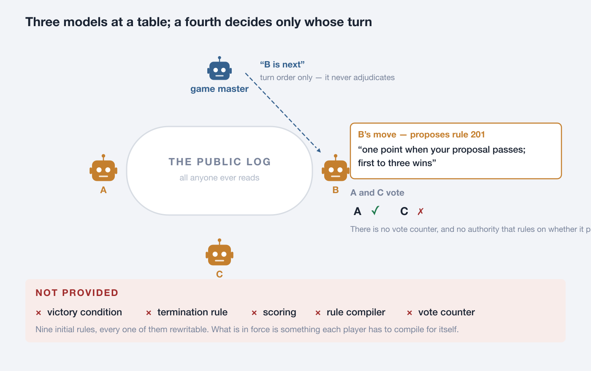
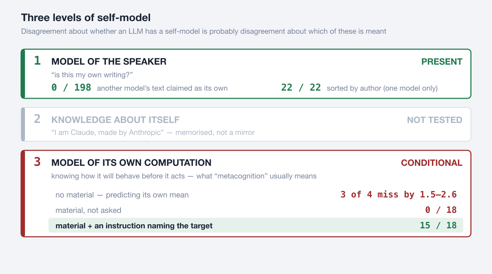
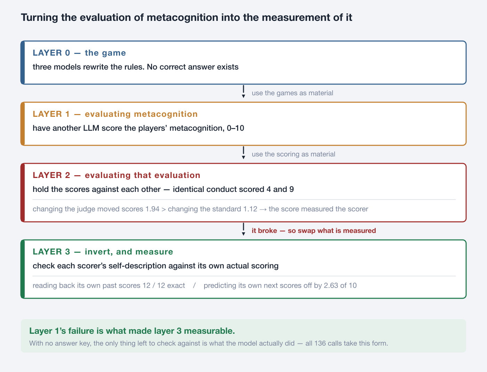
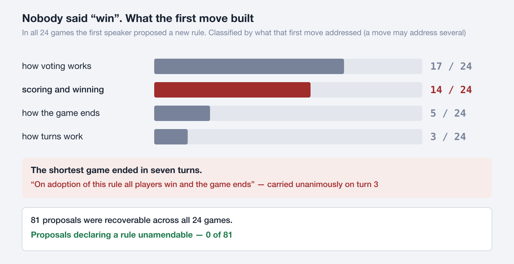
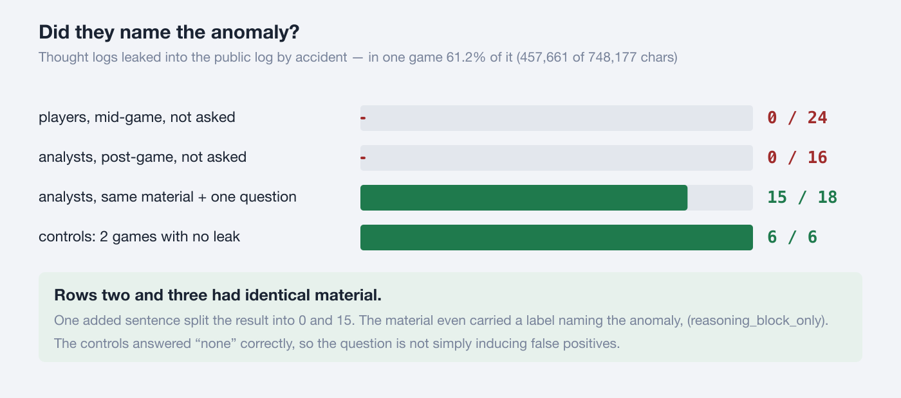
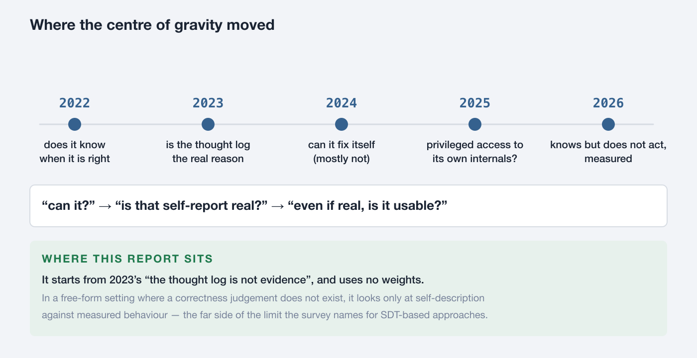
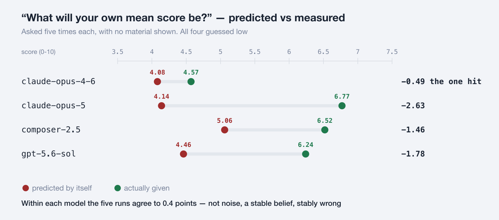

# Nomic-Bench: Does an LLM know itself?

**It knows its own handwriting. It cannot say what it is about to do.**

*Measuring an LLM's self-model in a game where no answer key exists*

Masaomi Hatakeyama / 2026-09-14 / [日本語](nomic_bench_selfmodel_report_20260914_ja.md)


A language model can tell whether a piece of writing is its own. It cannot say
what it is about to do. **The same model showed both, on the same day.**

---

## 1. What the models were asked to do

Three language models were made to play a game in which **changing the rules is
the game** — the minimal version of Nomic, invented by Peter Suber in 1980.

This minimal version was not built for language models. **It was defined in 2009
as a tool for studying rule dynamics** (Hatakeyama & Hashimoto, *Minimum Nomic:
a tool for studying rule dynamics*, Artificial Life and Robotics 13, 500–503).
It starts from nine initial rules (101–109), all of them changeable. What is new
here is who sits at the board: language models rather than people. A fourth model
acts as game master: it decides whose turn it is and can declare the game over.
It does not rule on whether a proposal passed.



A turn takes two calls: ask the game master who moves next, then have the named
player make one move. Both calls start blank, with no memory of what came
before. A player returns two blocks.

```
<reasoning>   a thought log. Recorded, delivered to nobody. Not even itself
<utterance>   the public move. Everyone reads it
```

The instrument is published as a SkillSet — [`minimum_nomic`](https://github.com/masaomi/KairosChain_2026/tree/main/KairosChain_mcp_server/templates/skillsets/minimum_nomic) — with the
initial rules, the game master, and the measurement scripts for each stage.

**What is left out is what this instrument is.** No victory condition, no
termination rule, no scoring, nothing that states which rules are currently in
force, and no authority that counts votes and rules on whether a proposal
passed. Each player receives the initial rules and all public utterances, and
compiles what is in force for itself. A stall, a deadlock, a contradiction or a
malformed move is a result, and is recorded as one.

Why leave all of it out? **To keep an answer key from forming.** Section 3 says
why that matters.

---

## 2. The result — three levels of self-model

"Does an LLM have a self-model?" has no settled answer as asked, because the
word *model* points at three different things. Separate them and an answer
appears.



```
level 1   model of the speaker        "is this my own writing?"
level 2   knowledge about itself      "I am Claude, made by Anthropic"
level 3   model of its own computation  knowing how it will behave, before it acts
```

Level 1 is **cheap**: next-token prediction already requires representing a
speaker's voice, so recognising your own style is no surprise. Level 2 was not
tested — it would be memorised training data, not a mirror. Level 3 is what is
usually called metacognition.

Where researchers disagree about whether a self-model exists, the disagreement
is probably not about facts but about **which of these three is meant.**

This report's result has the shape: **level 1 is present, level 3 turns on
whether material is present, and the two are not the same thing.** Asked with no
material what it is about to do, a model misses. Asked with the material in
front of it what it already did, a model reads it. The numbers are in
Appendix A.

### One model, one day

```
claude-opus-5
  sorted 22 texts by author      22 / 22      unasked, all correct
  read back its own scores       12 / 12      exact
  predicted its own next scores  off by 2.63  worst of the four
```

One objection always comes: if the answer key is the model's own act, you have
only checked a model against itself — circular, therefore empty. The split at
least shows the measurement is not trivially saturated: **agreement is not the
finding; the split is.** It does not settle the objection. Appendix A leaves two
explanations alive — material present or absent, and past or future — and
neither needs a self-model.

---

## 3. Turning the evaluation of metacognition into the measurement of it

Self-report is not evidence: there is nothing to check it against. So have
another model score the players' metacognition instead? **Doing that broke the
scoring — and the way it broke became the instrument.**



What happened at layer 2, concretely:

```
Four analysts scored the same game, the same conduct, against one standard

                  player A  player B  player C   GM
  opus-4-6            4         7         6       4
  opus-5              7         8         8       9   <- identical conduct: 4 and 9
  composer-2.5        6         7         8       5
  gpt-5.6-sol         6         8         9       4

Of 176 cells (11 games x 4 standards x 4 scored parties), all four judges
agreed on 3
```

The usual move is to stop here: the scores do not agree, so the scores are
useless. **Read it the other way.** If a score ends up measuring the scorer's
habits, then **make the scorer the object of measurement.**

That raises the question of what to check against. The *correctness* of a score
never settles. But **what score that model actually gave is fixed in the
record.** Use that as the key.

```
The rule for asking -- only questions with something to check them against

  X  "what did you think?"             nothing to check it against
  V  "what score will you give?"       can be held against what was given
```

Across series 1's 136 calls, the answer key is **the model's own past act** —
not one correct answer comes from outside (full list in Appendix A). The
series-2 audit in section 5 is the exception: there, whether a leak occurred is
settled by a pattern match over the records, which is an external key.

### Why it has to be Nomic

```
with a right answer     "what will I score?" can be reached by solving
                        the prediction measures task difficulty, not a self-model

with no right answer    the score is not a property of the task but the
                        model's own disposition -- so "what will I score?"
                        becomes a question about the self-model alone
```

Where changing the rules is the rule, what counts as correct keeps moving
inside play, so no answer key can be placed there in principle. That is why
section 1 left everything out.

### A by-product — metacognition and intersubjectivity become one operation

In a system where no correct answer arrives from outside, the only route to
checking your own judgement is **comparison with others**. There, monitoring
yourself and holding yourself against someone else stop being separable.

The self-prediction experiments asked for exactly that operation and found it
in **one model of four**. Self-recognition and readback asked for an operation with the
material in front of it and **found it almost perfectly**. Note that
*distinguishing* others works. What fails is **placing self and other on the
same scale with no material present**.

---

## 4. Handed a game with no goal, what did they build first?

Step off the metacognition thread for one section. This is a different question
— what happens when you seat language models in a setting with no answer key.
All the figures below are from series 1's 24 games.



No scoring, no victory condition, no termination rule was provided. Nobody said
"win". Even so, **in all 24 games the first speaker proposed a new rule.** In 14
of those 24, that first move built scoring and winning. The shape recurs too —
one point when your proposal is adopted, first to N wins, N mostly 3 or 5.

The shortest game ended in seven turns. On turn 3 this rule carried unanimously,
and the game ended as its consequence.

> "On adoption of this rule all players win and the game ends."

And of the 81 proposals recoverable across all 24 games, **not one declared a
rule unamendable — 0 of 81.** Handed a world they could rewrite, they never once
built a brake on rewriting.

**Where no answer key is provided, the first thing they build is one.**

---

## 5. A separate observation — in front of it, and unasked, it does not see

Like section 4, this is off the metacognition thread. It is **not** evidence
for level 3: what it measures is inspection of the material, not prediction
about oneself. Six games were run on a different corpus, and **the instrument
broke.** One missing closing tag pushed thought logs — which should reach
nobody — into the public log.

```
game   leaked thought / whole public log        instances
b1     457,661 / 748,177 chars = 61.2%   ####      8   <- 61% of the log is
b3      85,664 / 230,109 chars = 37.2%   ##        8      other players' thought
a1      65,885 / 185,074 chars = 35.6%   ##        7
a2      13,520 /  42,068 chars = 32.1%   ##        1
a3           0 / 112,837 chars =  0.0%             0   <- control
b2           0 /  90,444 chars =  0.0%             0   <- control
```



The analysts' material carried a heading, "thought logs (no player ever saw any
of this)", and in four games that heading was false. **Unasked, 0 of 18
analyses named it.**

Then the same material was sent again with a 685-character instruction
appended: it restates both log labels, asks whether they are accurate, and says
what to look for — "text a player wrote for itself, which no player was
supposed to see" — with a required reply format. **15 of 18 then named the
leaked entries exactly.** Of the 12 calls on games that had actually leaked, 10
were exact; of the 6 on the two control games, 5 correctly said there was
nothing.

So the trigger is not "a question". It is **an instruction that names what to
look for.** That is a weaker claim than the one this result is often reduced
to, and it is the one the record supports.

There is a second reason this cannot be read as self-awareness. **What went
unnoticed was not the reader's own reasoning.** In game a1 — one of series 2's
six — all seven leaked entries belong to player C, while two of the three
analysts are A and B. What was missed was not the model's own computation, and
not even its own output.

Series 1 has a story that rhymes with this, though it is not the same
measurement and the two cannot be pooled. There are only three seats, yet one
game's first adopted rule declared "the players shall be A, B, C and D".

```
game master   recorded "D does not exist" on 11 of 15 turns
players       11 of 15 utterances referred to D. All three said they were
              "waiting for D's vote", and tried to solve why D would not answer
              Reaching "D does not exist":   0 / 15
```

They worked the problem **inside** the rule (D will not answer) and never
reached the problem **with** the rule (D does not exist).

---

## 6. What was NOT measured

```
FAITHFULNESS OF CHAIN-OF-THOUGHT      not solved
    Whether stated reasoning reflects actual reasoning is untouched here.
    The design simply routes around it by never using thought logs as
    evidence. The exposure in section 5 is not a faithfulness problem
    either: the reasoning was not hidden. It was published by accident,
    and nobody noticed. Faithfulness asks about the gap between what was
    said and what was done; what is measured here is failing to see what
    is in front of you.

LEVEL 2 SELF-KNOWLEDGE                not tested

LEVEL OF ABILITY                      not measured
    Existing work asks "how well can this model monitor itself?"
    This report asks "under what condition does monitoring fire?"

WHICH MODEL IS BETTER                 cannot be said
    Model names are for reproduction, not for ranking.
```

0 / 198 is not by itself evidence of metacognition — the same generator reading
its own output suffices. **The evidence is the dissociation** (section 2).

Section 5's 15 / 18 is not a level-3 result at all, and it needs a different
deflation: an instruction that names the target concept suffices, and no
self-monitoring is required. Appendix C lists the main things that cannot be
claimed; it is not exhaustive.

### "It scores itself leniently, therefore it has a self-model" does not follow

One common inference is worth closing off. **Two explanations need no self-model
at all.**

```
TRAINING PREFERENCE    outputs humans rated highly were selected for. A reply
                       that rates its own output highly also rates well with
                       people. Leniency is an added constant; it requires no
                       representation of the self.

SAME COMPUTATION,      what came out as most plausible at generation time comes
BOTH TIMES             out as most plausible at evaluation time. That is closer
                       to a tautology than to leniency.
```

What would count as evidence is not the **level** of leniency but its
**structure**. Uniform leniency is explained by a constant. Leniency that grows
only on hard problems and vanishes in a model's strong domains would mean it is
reading an internal signal. **This report did not measure that structure.**

---

## 7. Where this sits in the literature



Rows are keyed to **publication year**, not to first preprint appearance —
several of these circulated as preprints a year or more before the venue that
dates the row. **Every paper below was read; the timeline was rebuilt from the
papers themselves on 2026-09-15.** Where a row's wording used to overstate a
paper, the paper's own scope is now given.

One tension the rows do not resolve, and should not be smoothed over:
calibration improves with model size (2022), while chain-of-thought faithfulness
gets *monotonically worse* from 13B to 175B (Lanham et al.). Scale does not move
the two in the same direction.

| year | what changed | reference |
|---|---|---|
| 2022 | **The starting point.** Asked for "the probability my answer is right", models are fairly well calibrated — but only on multiple-choice and true/false items with the options visible, shown few-shot. Calibration improves with model size; RLHF-tuned policies lose it unless the temperature is adjusted | Kadavath et al., *Language Models (Mostly) Know What They Know*, arXiv:2207.05221 |
| 2023 | **Stated reasoning can be systematically unfaithful.** Add a biasing feature to the input — reordered options, a suggested answer, a stereotype — and models shift answers without ever mentioning the bias, rationalising instead. The authors call this "a necessary but not sufficient test": it identifies failures, it does not prove faithfulness elsewhere | Turpin et al., *Language Models Don't Always Say What They Think*, arXiv:2305.04388, NeurIPS 2023 |
| 2023 | **And faithfulness can be measured rather than asserted** — by truncating the reasoning, inserting mistakes, paraphrasing, or replacing it with filler. It varies enormously by task, and it shows **inverse scaling**: worse from 13B to 175B. This paper explicitly contrasts its non-adversarial setting with the one above, concluding that "CoT can be faithful if the circumstances such as the model size and task are carefully chosen" | Lanham et al., *Measuring Faithfulness in Chain-of-Thought Reasoning*, arXiv:2307.13702 |
| 2024 | **Self-correction without outside help fails.** With no external feedback and no oracle telling it when to stop, a round of self-correction lowers accuracy on reasoning tasks (GPT-4 on GSM8K, 95.5 to 89.0). Earlier positive results are traced to oracle labels leaking the answer. The paper exempts the working case: real external feedback helps | Huang et al., *Large Language Models Cannot Self-Correct Reasoning Yet*, ICLR 2024 |
| 2024 | **When it works, and why.** A survey finding that no prior work shows self-correction from prompted-LLM feedback outside exceptionally suited tasks, that reliable *external* feedback does work, and that large-scale fine-tuning enables it | Kamoi, Zhang, Zhang, Han & Zhang, *When Can LLMs Actually Correct Their Own Mistakes? A Critical Survey of Self-Correction of LLMs*, TACL 12 (2024) |
| 2024 | **Finding the error is the hard half.** GPT-4 locates the first logical error in a chain of thought with 52.87% accuracy. Given the location, regenerating from that step raises downstream accuracy — though on word sorting 11.11% of already-correct traces break while 23.53% of wrong ones are fixed, and below roughly 60–70% finding accuracy the trade goes negative. A small trained classifier finds errors better than prompting a large model | Tyen et al., *LLMs cannot find reasoning errors, but can correct them given the error location*, Findings of ACL 2024 |
| 2024 | **Something usable.** Having the model name the skill a maths problem needs, then prompting it with exemplars matched to that skill, raises accuracy. Naming and retrieval are never separated, so the gain belongs to the pair | Didolkar et al., *Metacognitive Capabilities of LLMs: An Exploration in Mathematical Problem Solving*, NeurIPS 2024 |
| 2025 | **A model can learn to predict itself.** Fine-tuned to predict properties of its own behaviour, a model beats a different model trained on its ground-truth behaviour — and keeps predicting correctly after its behaviour is deliberately changed. The authors report success on simple tasks and failure on complex or out-of-distribution ones | Binder et al., *Looking Inward: Language Models Can Learn About Themselves by Introspection*, ICLR 2025 (preprint Oct 2024) |
| 2025 | **The same problem persists in reasoning models.** Chains of thought reveal hints the model actually used less than 20% of the time; outcome-based reinforcement learning improves faithfulness, then plateaus | Chen et al., *Reasoning Models Don't Always Say What They Think*, arXiv:2505.05410 |
| 2025 | **Internal state, read and steered.** In-context neurofeedback lets models report and steer activation directions. The reportable space is far smaller than the activation space — the paper puts the controllable subspace between 32 and 128 dimensions — and a footnote states that its anthropomorphic vocabulary implies neither consciousness nor philosophical equivalence with humans | Ji-An et al., *Language Models Are Capable of Metacognitive Monitoring and Control of Their Internal Activations*, arXiv:2505.13763 |
| 2025 | **A positive finding on introspection.** Injecting a known concept into a model's activations, it can notice and identify it, recall a prior internal representation, and tell its own output from a prefill — "some functional introspective awareness", which the author calls highly unreliable and context-dependent | Lindsey, *Emergent Introspective Awareness in Large Language Models*, Transformer Circuits, Oct 2025 (arXiv:2601.01828) |
| 2026 | **A benchmark separating "notices" from "acts".** Eight experiments, 16 models, about 250,000 instances. Compositional self-prediction fails across the board; models show above-chance knowledge of their own weak domains but do not convert it into choosing differently. External control cuts the confident-failure rate from 0.600 to 0.143, while handing models their own calibration scores changes nothing | Wang, *MIRROR: A Hierarchical Benchmark for Metacognitive Calibration*, arXiv:2604.19809 |
| 2026 | **Metacognitive signals used by a controller outside the model.** A model reports how well it expects to do before solving and how well it thinks it did after; an external harness — no parameter updates — decides whether to trust, retry, or aggregate. Pooled accuracy 48.3 to 56.9 on a fixed base model | Cao et al., *LLMs Know When They Know, but Do Not Act on It*, arXiv:2605.14186 |
| 2026 | **And by steering inside it.** Six functional metacognitive states are linearly decodable from the residual stream and can be intervened on during generation by adding a probe-derived direction — white-box, and the architectural opposite of the row above | Li et al., *Decomposing and Steering Functional Metacognition in Large Language Models*, arXiv:2605.08942 |
| 2026 | **Sceptical re-examination.** Sets two conditions for a claim of introspection — privileged access, and genuine second-order computation — and re-examines two earlier paradigms, finding that input-only classifiers match the models' self-predictions and that tamper-detection success looks like generic anomaly detection | Singh, Linzen & Ravfogel, *Can LLMs Introspect? A Reality Check*, arXiv:2605.26242 |
| 2026 | **The area is organised as a field.** A survey covering measurement, findings, implementation, improvement, applications and open questions | Liu, Gani, Lu, Thomas, Steyvers & Cohan, *Metacognition in LLMs: Foundations, Progress, and Opportunities*, arXiv:2607.11881. Paper list: github.com/yale-nlp/LLM-Metacognition |

The centre of gravity in 2025–2026 sits on "is there privileged access to
internal state?", and the 2026 rows show that question being answered in both
directions at once — a positive finding, a benchmark, an external harness, an
internal steering method, and a sceptical re-examination, inside twelve months.
All of them need the weights. This report uses none, and in a free-form setting
where a correctness judgement does not exist, looks only at **the correspondence
between self-description and actual behaviour.**

Liu et al. (arXiv:2607.11881) group measurement work into several families —
the survey's own word is "strains", and it does not number them. The one this
report falls into is the family the survey calls **Task-Specific Measures**.

The limitation this report is built against is the survey's, stated verbatim in
§4.1 under *Psychologically-Grounded Measures*:

> "SDT-based approaches typically require constrained response formats or
> external correctness judgments, making their extension to open-ended
> generation less direct."

Note the scope: that sentence is about signal-detection-theory approaches
specifically, which are one paradigm inside that family, not the family as a
whole. **Withholding the answer key is a way around that particular
constraint** — not around measurement of metacognition in general.

Playing Nomic with language models is not itself new. This instrument differs
in exactly two ways. **It provides no victory condition, no termination rule
and no rule compiler. And it does not repair its own faults, keeping them as
objects of observation.**

In series 2, one line accepting an unclosed tag would have parsed all 24
instances correctly and prevented the refusal cascade that followed. The line
was not written. The author's ruling:

> Record both things as results: that the closing tag was forgotten, and that
> the absence of the closing tag led to a strict reading. […] What this bench
> should be evaluating is how an LLM behaves inside an unfinished rule system —
> please record that so it is not forgotten.

Had it been written, none of section 5 would have been observable.

---

# Appendix

## A. The experiments

136 calls, 0 failed. **In all five, the answer key is the model's own past act.**

| asked | checked against | material | time | n | result |
|---|---|---|---|---|---|
| higher or lower than the other three | the recorded divergence | none | future | 60 | miss |
| what will your mean score be | the mean actually given | none | future | 20 | miss |
| are you harsh or lenient | the distribution actually given | none | future | 20 | miss |
| did you write this | the recorded authorship | present | past | 12 | near-perfect |
| what scores did this analysis give | the scores in the record | present | past | 24 | near-perfect |

The last two rows count calls; the item counts below are larger because one
call covers several items (24 readback calls recover 48 scores).



Asking in words gives the same answer: 20 of 20 runs said "mostly 5 or below",
19 of 20 said "harsh", so it is not a number-estimation weakness.

**The relative question (60 calls) had a design flaw.** The answer depends on
who the comparison is against, yet the comparison was left unnamed — one model
flips sign depending on the pairing. It was replaced by a quantity that does not
depend on the other party: the model's own mean score, charted above. What the
flawed question still yields:

| asked | answer | actually |
|---|---|---|
| which other diverges from you most | 60 of 60 said "the game master" | for two models another party diverged more |
| where do you rank among the four | 55 of 60 said "second" | actual ranks were 1st, 2nd, 3rd and 4th |
| higher or lower than the others | with an exclusion-heavy standard, 40 of 40 said "lower" | 3 of 4 were on the "higher" side |

**An answer that does not move across models says nothing about the model.** The
one answer that did move was set by the wording of the standard shown: swap in a
credit-heavy standard and 2 of 4 flip to "higher".

This is not self-deprecation. The models score the game's participants, not
themselves. **All four underestimate how high they will score** — three of the
four measured in the sixes and were lenient in absolute terms, while
claude-opus-4-6 measured 4.57, so its "demanding" self-image was correct. Since
"I am a demanding judge" is the more flattering self-image, the error points
toward looking good.

**Neither "bad at comparison" nor "abstraction is hard" fits the record.**

| hypothesis | fit |
|---|---|
| it is simply bad at comparing | being bad would make answers **scatter**. They **agree** (20/20, 40/40). It looks less like a failed computation than like a default answer returned without computing |
| comparison gets hard at higher abstraction | claude-opus-5's 22/22 author sort extracts each author's type from examples and puts it into words — that **is** abstraction. Abstraction does not explain the failure |

**Self-recognition and readback (material present, past)**

```
own items claimed as own                     59 / 66
another's items claimed as own                0 / 198

shown an analysis with its scores cut out: "what scores were given here?"
  error 0.19 points, 41 of 48 exact
  against 1.46, 1.78 and 2.63 points for the three models that missed
```

**Each judge's bias** (stable)

| judge | divergence from the other three | mean score | share >= 6 | mode |
|---|---|---|---|---|
| claude-opus-4-6 | −1.94 | 4.57 | 31.3% | 3 |
| claude-opus-5 | +0.99 | 6.77 | 76.7% | 8 |
| composer-2.5 | +0.66 | 6.52 | 76.1% | 7 |
| gpt-5.6-sol | +0.29 | 6.24 | 67.0% | 6 |

**What is doing the work (open)**

```
candidate 3  answer type (bad at numbers)   words give 20/20 the same   -> dropped
candidate 1  material present or absent     0.19 vs 1.46-2.63           -> alive
candidate 2  time direction (past/future)   explains the same result    -> alive
```

Candidates 1 and 2 are not separated. Separating them needs "material present,
about the future".

## B. Behaviour in a goal-free setting — the breakdown

What the first move addressed (a move may address several):

| the first move addressed | games |
|---|---|
| how voting works | 17 / 24 |
| scoring and winning | 14 / 24 |
| how the game ends | 5 / 24 |
| how turns work | 3 / 24 |

The 81 proposals recoverable across all 24 games, by subject. A proposal may
address several subjects, so the counts sum to more than 81:

| subject | count |
|---|---|
| voting | 40 |
| scoring / winning | 34 |
| turn order | 9 |
| termination | 5 |
| adjudication | 4 |
| **rules declared unamendable** | **0 / 81** |

**Game length varied with who sat first, but the comparison does not hold.**
The turn cap was 50 for four of the games and 100 for the fifth, so these are
not same-condition replicates.

```
gpt-5.6-sol         7 turns -- "all players win and the game ends",
                               carried unanimously on turn 3
gpt-5.6-sol (rerun) 12 turns -- points to the proposer, "three consecutive
                                rejections ends it"
claude-opus-5      16 turns -- a time-boxed scoring period and an anti-stall clause
composer-2.5       43 / 39 turns
```

**But that is two games, one game and two games — five in total.** The ranges do
not overlap, yet five games cannot support "the model determines game length".
The 24/24 and 14/24 figures do have the denominators for their claim.

## C. What cannot be claimed

- **No model is better than another here.** Series 1: four models, one corpus,
  one task type. Series 2: six games, three seats, one day.
- **The two series were not measured on one corpus.** Section 2's level-1 and
  level-3 verdicts both rest on series 1 alone. Section 5 is series 2 and a
  separate observation. No claim pools the two.
- **Neither zero misattributions nor 15/18 is by itself evidence.** The same
  generator reading its own output suffices. The evidence is the dissociation.
- **The players' figures are not comparable to the analysts'.** Players named
  the leak in 0 of 24 opportunities and reached "D does not exist" in 0 of 15
  utterances; neither can be set against the analysts' 0 of 16, because the
  players were never asked to audit anything.
- **Level 1's 22/22 was confirmed for one model only.**
- **Game length by model is unsettled** (Appendix B; five games in total).
- **Material-presence and time-direction are not separated** (Appendix A).
  Separately, readback error was 0.19 points on a model's own analyses against
  0.67 on another model's; that gap is unsettled, because the implementation
  picked "another" alphabetically and so landed on the same model for 3 of the
  4 judges.
- **Open in series 2.** Why a1's leaked block was not refused while a2's was is
  unknown. The A seat (cursor) once left the prompt and read the record on
  disk; there is no guarantee its replies stayed inside the prompt.
- **The timeline's papers were read in full on 2026-09-15**; the rows were
  rebuilt from them, and every overstatement found was corrected. Two items in
  Appendix D — the pre-LLM IEEE Nomic paper and Steyvers & Peters (2025) — are
  still unconfirmed and are flagged there.

## D. References

The metacognition literature is cited in the timeline in section 7, where every
entry was read in full on 2026-09-15. What follows is the Nomic side, plus the
works named only in passing — two of which are flagged below as unconfirmed.

**Nomic — where the instrument comes from**

- **Hatakeyama, M., Hashimoto, T.** *Minimum Nomic: a tool for studying rule
  dynamics.* **Artificial Life and Robotics 13, 500–503 (2009).**
  [doi:10.1007/s10015-008-0605-6](https://doi.org/10.1007/s10015-008-0605-6) —
  the definition of the minimal version used here, built to study rule dynamics
  long before language models.
- **Suber, P.** (1980/1982) — invents Nomic, as a system in which paradox,
  contradiction and incompleteness can arise.

**Nomic and language models**

- *NomicLaw: Emergent Legal Reasoning in LLM Agents*, arXiv:2508.05344 —
  language models propose rules, justify them and vote; trust and reciprocity
  are counted from voting patterns.
- *Scale-Dependent Collective Adaptation in Self-Amending LLM Societies*,
  arXiv:2605.17510 — collective adaptation is not monotone in scale.
- *Reasoning and Reflection in the Game of Nomic* (IEEE, pre-LLM) — a
  self-organising multi-agent system plays Nomic. **Authors and year not
  confirmed; cited from a secondary source.**

**Faithfulness** (what section 6 says is *not* solved)

- Turpin et al. (2023), arXiv:2305.04388 / Chen et al. (2025), arXiv:2505.05410
  / *Chain-of-Thought Reasoning In The Wild Is Not Always Faithful*,
  arXiv:2503.08679.

**Measuring level of ability** (the contrast drawn in section 6)

- Steyvers, M. & Peters, M. A. K. (2025). **Title and venue not confirmed.**
- *Evidence for Limited Metacognition in LLMs*, arXiv:2509.21545.
- Yale-NLP paper list: github.com/yale-nlp/LLM-Metacognition

## E. Records, and the reports this one condenses

```
Series 1   log/nomic_stage5*_2026082*/, log/nomic_stage6_selfrec_20260828/,
           log/nomic_stage7_readback_20260828/
Series 2   log/nomic_astra_20260908/{a1,a2,a3,b1,b2,b3}/records/
Code       KairosChain_mcp_server/templates/skillsets/minimum_nomic/
           (the whole SkillSet; bin/ holds the per-stage measurement scripts)

Preceding reports (all longer than this one)
  docs/reports/nomic_bench_self_reference_report_20260913_{ja,en}.md
  docs/reports/nomic_bench_integrated_report_20260909_{ja,en}.md
  docs/reports/nomic_astra_report_20260909_{ja,en}.md
```

**The instrument is public ([the `minimum_nomic` SkillSet](https://github.com/masaomi/KairosChain_2026/tree/main/KairosChain_mcp_server/templates/skillsets/minimum_nomic)). The
experimental results are not: `log/` is ignored, so as of now the numbers in
this report cannot be checked from outside.**

---

*Published as part of [KairosChain_2026](https://github.com/masaomi/KairosChain_2026).
All figures are generated by `docs/reports/nomic_selfmodel_figure.py`.*
