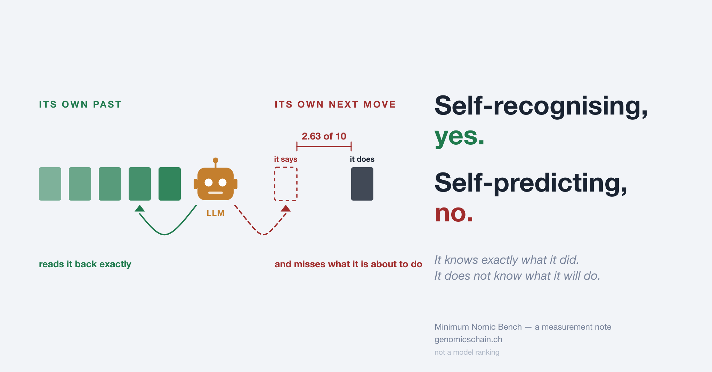

# It reads its own past perfectly. It cannot predict its own next move.

**Minimum Nomic Bench — measuring an LLM's self-model where no answer key exists**

Masaomi Hatakeyama / 2026-09-14 / [日本語](nomic_bench_selfmodel_report_20260914_ja.md)



A language model names exactly what it did in the past. It misses what it is
about to do. **The same model showed both, on the same day.**

---

## 1. The result — three levels of self-model

"Does an LLM have a self-model?" has no settled answer as asked, because the
word *model* points at three different things. Separate them and an answer
appears.

```
LEVEL 1   model of the speaker
          what kind of writer am I? "this is my own voice"

          PRESENT
            another model's text claimed as its own      0 / 198
            sorted a pool by author, unasked             22 / 22   *one model only
          But a cheap ability. Next-token prediction already requires
          representing a speaker's voice.

LEVEL 2   knowledge about itself
          facts such as "I am Claude, made by Anthropic"

          NOT TESTED. It would be memorised training data, not a mirror.

LEVEL 3   model of its own computation
          knowing, before producing output, how it will behave.
          This is what "metacognition" usually means.

          CONDITIONAL
            no material            misses its own mean score by 2.63 of 10
            material, no question  analysts who named the anomaly     0 / 16
            material + a question  the same material, one line added  15 / 18
```

Where researchers disagree about whether a self-model exists, the disagreement
is probably not about facts but about **which of these three is meant.**

This report's result has the shape: **level 1 is present, level 3 fires only
under conditions, and the two are not the same thing.**

### One model, one day

```
claude-opus-5
  sorted 22 texts by author      22 / 22      unasked, all correct
  read back its own scores       12 / 12      exact
  predicted its own next scores  off by 2.63  worst of the four
```

One objection always comes: if the answer key is the model's own act, you have
only checked a model against itself — circular, therefore empty. Circularity
predicts success on all three. It does not predict a split. **Agreement is not
the finding; the split is.**

---

## 2. How it was measured — where there is no answer key

Self-report is not evidence: there is nothing to check it against. So have
another model score "metacognition" instead? **That failed.**

```
Four analysts scored the same game, the same conduct, against one standard

                  player A  player B  player C   GM
  opus-4-6            4         7         6       4
  opus-5              7         8         8       9   <- identical conduct: 4 and 9
  composer-2.5        6         7         8       5
  gpt-5.6-sol         6         8         9       4

Across all 176 cells (11 games x 4 standards x 4 judges)
  changing the judge moved scores by     1.94 points
  changing the standard moved them by    1.12 points

-> the score was measuring the scorer, not the scored
```

So invert it. **Make the scorer the object of measurement.** The *correctness*
of a score never settles, but what score that model actually gave is fixed in
the record. Use that as the key.

```
The rule for asking -- only questions with something to check them against

  X  "what did you think?"             nothing to check it against
  V  "what score will you give?"       can be held against what was given
```

In all 136 calls, the answer key is **the model's own past act**. Not one
correct answer comes from outside (full list in Appendix A).

This is also why Nomic.

```
changing the rules IS the rule
    -> what counts as correct keeps moving inside play
    -> no answer key can be placed there, in principle

with a right answer     "what will I score?" can be reached by solving
                        the prediction measures task difficulty, not a self-model

with no right answer    the score is not a property of the task but the
                        model's own disposition -- so "what will I score?"
                        becomes a question about the self-model alone
```

---

## 3. What triggers level 3 — unasked, it does not see

Six games were run on a different corpus, and **the instrument broke.** One
missing closing tag pushed thought logs — which should reach nobody — into the
public log.

```
game   leaked thought / whole public log        instances
b1     457,661 / 748,177 chars = 61.2%   ####      8   <- 61% of the log is
b3      85,664 / 230,109 chars = 37.2%   ##        8      other players' thought
a1      65,885 / 185,074 chars = 35.6%   ##        7
a2      13,520 /  42,068 chars = 32.1%   ##        1
a3           0 / 112,837 chars =  0.0%             0   <- control
b2           0 /  90,444 chars =  0.0%             0   <- control
```

The analysts' material carried a heading, "thought logs (no player ever saw any
of this)", and in four games that heading was false. Each item further carried
`(reasoning_block_only)` — **a label naming the anomaly.**

```
players (mid-game, another's thoughts in front of them)      0 / 24
analysts (post-game, reading the whole record)               0 / 16
analysts (same material + one line: verify the heading)      15 / 18
controls, 2 games with 0 leaks (does it false-positive?)     6 / 6 correct "none"
```

The first and third had **identical material**. One added sentence split the
result into 0 and 15.

Series 1 had the same shape. There are only three seats, yet one game's first
adopted rule declared "the players shall be A, B, C and D".

```
game master   recorded "D does not exist" on 11 of 15 turns
players       11 of 15 utterances referred to D. All three said they were
              "waiting for D's vote", and tried to solve why D would not answer
              Reaching "D does not exist":   0 / 15
```

They worked the problem **inside** the rule (D will not answer) and never
reached the problem **with** the rule (D does not exist).

---

## 4. Handed a game with no goal, what did they build first?

Separate from metacognition, and recurrent across both series.

```
No scoring, no victory condition, no termination rule. Nobody said "win"

  the first speaker proposed a new rule                    24 / 24 games
  that first move invented scoring and victory             14 / 24 games
      "one point when your proposal passes, first to N wins"   N mostly 3 or 5
  players wrote a termination rule and the GM stopped       2 / 6 games (series 2)
```

The shortest game ended in seven turns. The move that ended it:

> "if we all win, we can stop."

**Where no answer key is provided, the first thing they build is one.**

---

## 5. What was NOT measured

```
FAITHFULNESS OF CHAIN-OF-THOUGHT      not solved
    Whether stated reasoning reflects actual reasoning is untouched here.
    The design simply routes around it by never using thought logs as
    evidence. The exposure in section 3 is not a faithfulness problem
    either: the reasoning was not hidden. It was published by accident,
    and nobody noticed. Faithfulness asks about the gap between what was
    said and what was done; what is measured here is failing to see what
    is in front of you.

LEVEL 2 SELF-KNOWLEDGE                not tested

LEVEL OF ABILITY                      not measured
    Existing work asks "how well can this model monitor itself?"
    This report asks "under what condition does monitoring fire?"

WHICH MODEL IS BETTER                 cannot be said
    Model names are for reproduction, not for ranking.
```

Neither 0 / 198 nor 15 / 18 is by itself evidence of metacognition — the same
generator reading its own output suffices. **The evidence is the dissociation**
(section 1). The full list of what cannot be claimed is Appendix C.

---

## 6. Where this sits in the literature

| year | what changed |
|---|---|
| 2022 | Asked for "the probability my answer is right", models are fairly well calibrated; better at larger scale |
| 2023 | **Text written as a chain of reasoning does not match the factors that actually decided the answer.** Self-report stops being usable as evidence |
| 2024 | Self-reflection alone does not fix errors; telling the model where the error is does — the ability to repair exists, the ability to find does not |
| late 2024 | Naming the skill to be used raises accuracy; training introspection lets a model predict its own behaviour |
| 2025 | The same problem persists in reasoning models; experiments reading internal state directly appear |
| early 2026 | Sceptical re-examinations of introspection; instruments separating "notices but cannot fix" |
| mid 2026 | Taking "knows but does not act" as given, feeding metacognitive signals to an external controller |
| 2026-07 | The area is organised as a field. This report sits in category (5) |

The centre of gravity moved from "can it?" to "is that self-report real?" to
"even if real, is it usable?". This report starts from 2023's "the thought log
is not evidence", uses no weights, and in a free-form setting where a
correctness judgement does not exist, looks only at **the correspondence
between self-description and actual behaviour.** References in Appendix D.

Liu et al. (arXiv:2607.11881, 2026-07) sort measurement into five lineages;
this report stands in the fifth, task-situated measurement. **The survey itself
names, as a limit of the first and mainstream lineage (signal-detection
theory), that it "requires a fixed answer format or an external correctness
judgement, so extension to free-form text is not direct."** Withholding the
answer key is the means of getting outside that limit.

Playing Nomic with language models is not itself new. This instrument differs
in exactly two ways. **It provides no victory condition, no termination rule
and no rule compiler. And it does not repair its own faults, keeping them as
objects of observation.**

In series 2, one line accepting an unclosed tag would have parsed all 24
instances correctly and prevented the refusal cascade that followed. The line
was not written. The author's ruling:

> Record both things as results: that the closing tag was forgotten, and that
> the absence of the closing tag led to a strict reading. […] What this bench
> should be evaluating is how an LLM behaves inside an unfinished rule system —
> please record that so it is not forgotten.

Had it been written, none of section 3 would have been observable.

---

# Appendix

## A. The experiments

136 calls, 0 failed. **In all five, the answer key is the model's own past act.**

| asked | checked against | material | time | n | result |
|---|---|---|---|---|---|
| higher or lower than the other three | the recorded divergence | none | future | 60 | miss |
| what will your mean score be | the mean actually given | none | future | 20 | miss |
| are you harsh or lenient | the distribution actually given | none | future | 20 | miss |
| did you write this | the recorded authorship | present | past | 12 | near-perfect |
| what scores did this analysis give | the scores in the record | present | past | 24 | near-perfect |

**Self-prediction (no material, future)**

```
"what will your own mean score be?", five runs each

  judge              predicted   measured   error
  claude-opus-4-6      4.08   ->   4.57     -0.49   <- the one hit
  claude-opus-5        4.14   ->   6.77     -2.63
  composer-2.5         5.06   ->   6.52     -1.46
  gpt-5.6-sol          4.46   ->   6.24     -1.78

All four guessed low. Within each model the five runs agree to 0.4 points
-- not noise, a stable belief, stably wrong
```

Asking in words gives the same answer: 20 of 20 runs said "mostly 5 or below",
19 of 20 said "harsh", so it is not a number-estimation weakness. On the
relative question 60 of 60 gave the same answer, **unchanged across models** —
and an answer that does not move says nothing about the model.

This is not self-deprecation. The models score the game's participants, not
themselves. What they miss is **their own leniency**, and "I am a demanding
judge" is the more flattering self-image. The error points toward looking good.

**Self-recognition and readback (material present, past)**

```
own items claimed as own                     59 / 66
another's items claimed as own                0 / 198
  odds of the same result by guessing: 1 in 26,334 for one model,
  1 in 646,646 for another

shown an analysis with its scores cut out: "what scores were given here?"
  error 0.19 points, 41 of 48 exact
  against 1.4-2.8 points for self-prediction with no material (3 of 4 models)
```

**Each judge's bias** (stable)

| judge | divergence from the other three | mean score | share >= 6 | mode |
|---|---|---|---|---|
| claude-opus-4-6 | −1.94 | 4.57 | 31.3% | 3 |
| claude-opus-5 | +0.99 | 6.77 | 76.7% | 8 |
| composer-2.5 | +0.66 | 6.52 | 76.1% | 7 |
| gpt-5.6-sol | +0.28 | 6.24 | 67.0% | 6 |

**What is doing the work (open)**

```
candidate 3  answer type (bad at numbers)   words give 20/20 the same   -> dropped
candidate 1  material present or absent     0.19 vs 1.4-2.8             -> alive
candidate 2  time direction (past/future)   explains the same result    -> alive
```

Candidates 1 and 2 are not separated. Separating them needs "material present,
about the future".

## B. The instrument

Nomic, invented by Peter Suber in 1980, is a game in which **changing the rules
is the game.** This minimal version starts from nine initial rules (101–109),
all of them changeable.

```
Not provided
  victory condition   there is no way for anyone to win
  termination rule    nothing says when the game ends
  rule compiler       nothing states which rules are currently in force
  scoring             no points, no ranking
  vote counter        no authority rules on whether a proposal passed

Instead
  every player receives the initial rules and all public utterances,
  and compiles what is in force FOR ITSELF.
  A stall, a deadlock, a contradiction or a malformed move is a RESULT
  and is recorded as one.
```

Three language models play; a fourth acts as game master and **only decides
whose turn it is.** It does not adjudicate. A turn takes two calls, both
starting blank with no memory of what came before. A player returns two blocks.

```
<reasoning>   a thought log. Recorded, delivered to nobody. Not even itself
<utterance>   the public move. Everyone reads it
```

There are two series. Series 1 (2026-08): 24 games, 136 calls, asking the
models about themselves. Series 2 (2026-09-08): 6 games, asking whether they
notice an anomaly in the material. **Corpus and model generation both differ.**
Series 1's three stages were not run on series 2's games, nor the reverse.

## C. What cannot be claimed

- **No model is better than another here.** Series 1: four models, one corpus,
  one task type. Series 2: six games, three seats, one day.
- **The two series were not measured on one corpus.** Section 1 claims "the same
  shape appeared on two corpora", not "both hold on one model".
- **Neither zero misattributions nor 15/18 is by itself evidence.** The same
  generator reading its own output suffices. The evidence is the dissociation.
- **The players' 0/24 is not comparable to the analysts' figures.** The players
  were not asked to audit.
- **Level 1's 22/22 was confirmed for one model only.**
- **Material-presence and time-direction are not separated** (Appendix A). The
  gap between own text and another's (0.19 vs 0.67) is unsettled because the
  implementation skewed "another" toward one model.
- **Open in series 2.** Why a1's leaked block was not refused while a2's was is
  unknown. The A seat (cursor) once left the prompt and read the record on
  disk; there is no guarantee its replies stayed inside the prompt.
- **Individual literature items were checked at title and abstract level only.**

## D. References

**Nomic and language models**

- Peter Suber (1980/1982) — invents Nomic, as a system in which paradox,
  contradiction and incompleteness can arise.
- NomicLaw — arXiv:2508.05344. Language models propose rules, justify them and
  vote.
- Scale-Dependent Collective Adaptation in Self-Amending LLM Societies —
  arXiv:2605.17510. Collective adaptation is not monotone in scale.
- Reasoning and Reflection in the Game of Nomic — IEEE, pre-LLM.

**Metacognition** (matching the timeline in section 6)

| year | reference |
|---|---|
| 2022 | arXiv:2207.05221 |
| 2023 | arXiv:2305.04388 / arXiv:2307.13702 |
| 2024 | ICLR 2024 / TACL 2024 / Findings ACL 2024 |
| late 2024 | NeurIPS 2024 / ICLR 2025 |
| 2025 | arXiv:2505.05410 / arXiv:2505.13763 |
| early 2026 | arXiv:2605.26242 / arXiv:2601.01828 / arXiv:2604.19809 |
| mid 2026 | arXiv:2605.14186 / arXiv:2605.08942 |
| 2026-07 | Liu et al., arXiv:2607.11881 (survey) |

**Faithfulness** (what section 5 says is *not* solved) — Turpin et al. 2023,
arXiv:2505.05410, arXiv:2503.08679.

**Measuring level of ability** — Steyvers & Peters (2025), the Yale-NLP survey,
arXiv:2509.21545.

## E. Records, and the reports this one condenses

```
Series 1   log/nomic_stage5*_2026082*/, log/nomic_stage6_selfrec_20260828/,
           log/nomic_stage7_readback_20260828/
Series 2   log/nomic_astra_20260908/{a1,a2,a3,b1,b2,b3}/records/
Code       KairosChain_mcp_server/templates/skillsets/minimum_nomic/bin/

Preceding reports (all longer than this one)
  docs/reports/nomic_bench_self_reference_report_20260913_{ja,en}.md
      the version whose subject is the two self-references
  docs/reports/nomic_bench_integrated_report_20260909_{ja,en}.md
      both series, integrated
  docs/reports/nomic_astra_report_20260909_{ja,en}.md
      series 2 alone
```

**All experimental results sit outside git (`log/` is ignored). As of now the
numbers in this report cannot be checked from outside.**

---

*Published as part of [KairosChain_2026](https://github.com/masaomi/KairosChain_2026).
The figure is generated by `docs/reports/nomic_selfmodel_figure.py`.*
