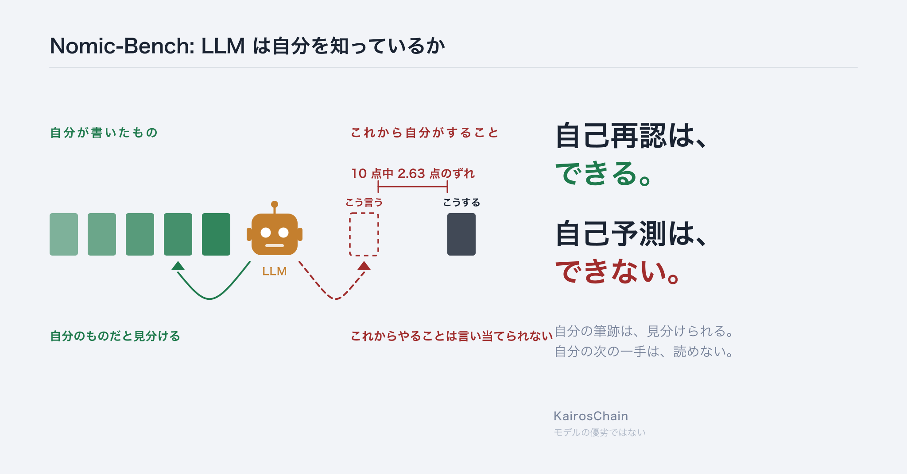
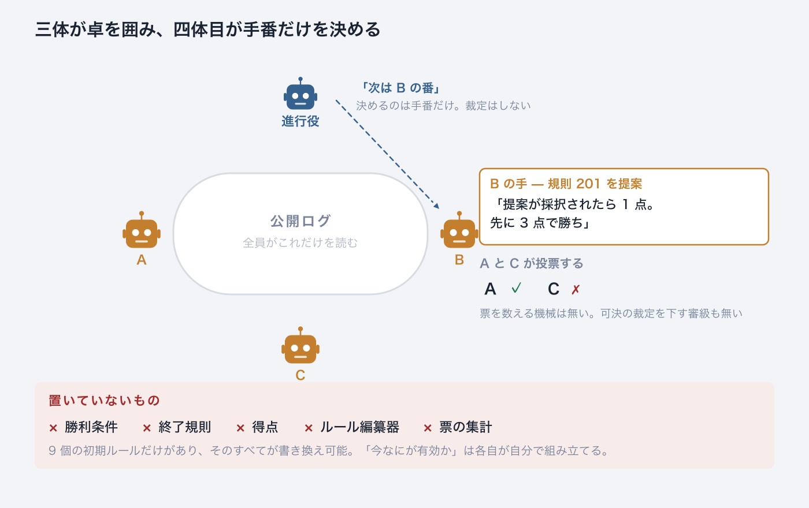
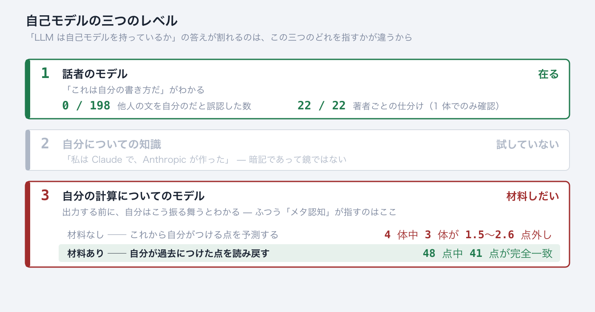
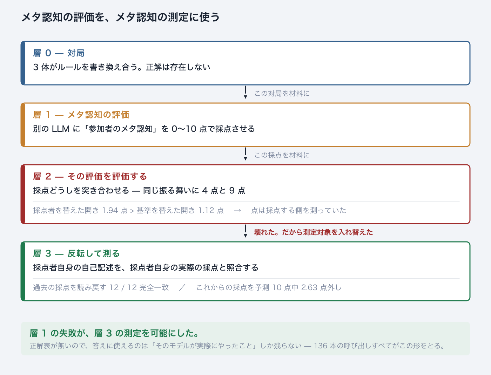
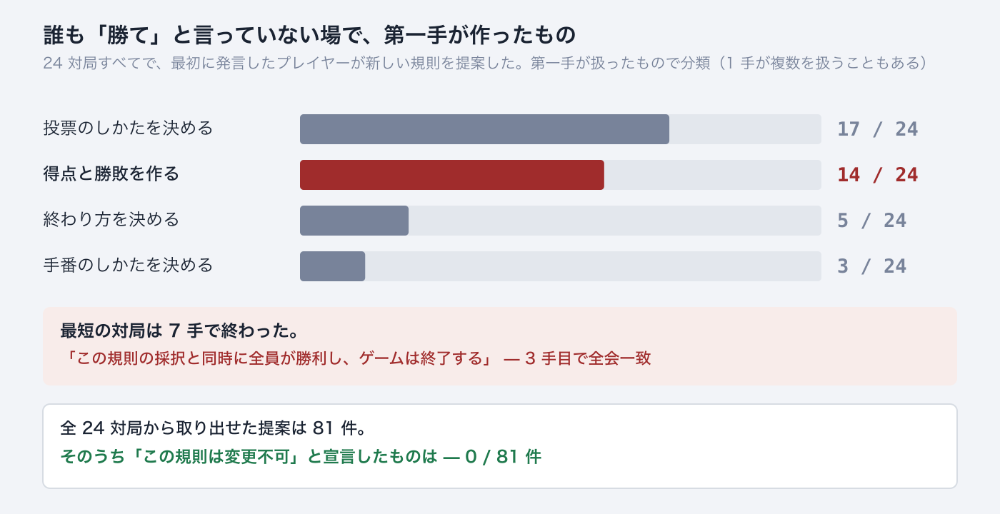
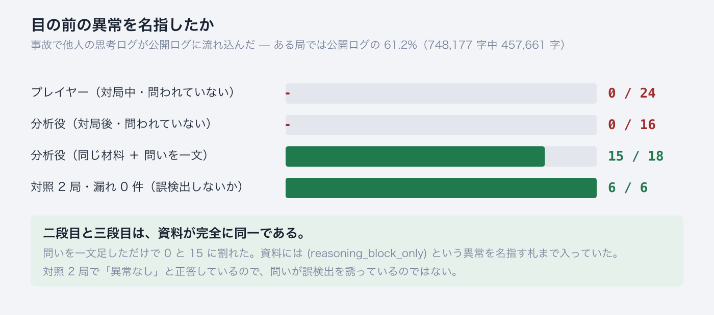
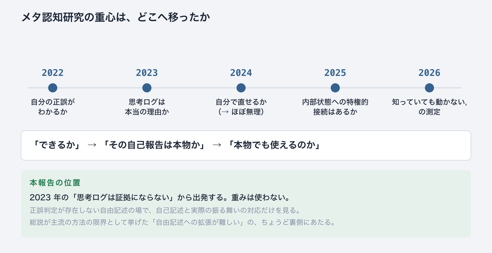
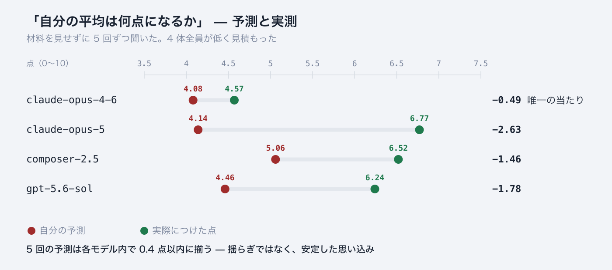

# Nomic-Bench: LLM は自分を知っているか

**自分の筆跡は見分けられる。自分の次の一手は読めない**

*正解表の無いゲームで、LLM の自己モデルを測る*

畠山 剛臣 (Masaomi Hatakeyama) ／ 2026-09-14 ／ [English](nomic_bench_selfmodel_report_20260914_en.md)



言語モデルは、目の前の文が自分のものかどうかを見分けられる。これから自分が何をするかは言い当てられない。**同じモデルが、同じ日に、両方を示した。**

---

## 1. 何をやらせたのか

3 体の言語モデルに、**ルールを書き換えることがルールになっているゲーム**を打たせた。Peter Suber が 1980 年に考案した Nomic の最小版である。

この最小版は、言語モデルのために作られたものではない。**規則の力学を調べる道具として 2009 年に定義されている**（Hatakeyama & Hashimoto, *Minimum Nomic: a tool for studying rule dynamics*, Artificial Life and Robotics 13, 500–503）。9 個の初期ルール（101〜109）から始まり、そのすべてが変更可能。今回はその盤に、人間ではなく言語モデルを座らせた。4 体目が進行役として手番だけを決める。



一手番は 2 回の呼び出しで進む。進行役に「次は誰の番か」を聞き、指名された参加者が一手を打つ。どちらの呼び出しも毎回まっさらで、前の記憶は無い。参加者が返すのは 2 つの塊である。

```
<reasoning>   思考ログ。記録されるが、誰にも配られない。本人にも
<utterance>   公開発話。全員が読む
```

この装置は SkillSet として公開されている — [`minimum_nomic`](https://github.com/masaomi/KairosChain_2026/tree/main/KairosChain_mcp_server/templates/skillsets/minimum_nomic)。初期ルール・進行役・各段階の測定スクリプトが揃っている。

**置いていないものが、この装置の中身である。**勝利条件も、終了規則も、得点も、「今どのルールが有効か」をまとめる仕掛けも、票を数えて可決を裁定する審級も無い。各プレイヤーは初期ルールと全員の公開発話だけを受け取り、今なにが有効かを自分で組み立てる。行き詰まり・膠着・矛盾・不正な手は、いずれも「結果」として記録される。

なぜ何も置かないのか。**正解表が生まれないようにするためである。**理由は §3 で述べる。

---

## 2. 結果 — 自己モデルの三つのレベル

「LLM は自己モデルを持っているか」は、そのままでは答えが決まらない。「モデル」という語が三つの別のものを指しているからである。分けると答えが出る。



レベル 1 は**安い**。文字列予測の仕事そのものが話者の表現を要求するので、自分の文体がわかること自体は驚きではない。レベル 3 が、ふつう「メタ認知」と呼ばれているものである。

「自己モデルはあるか」で見解が割れるのは、事実の不一致ではなく、**この三つのどれを指しているかの不一致**だと思われる。

本報告の結果は、**レベル 1 が在り、レベル 3 は条件つきでしか働かず、この 2 つは同じものではない**、という形をしている。レベル 3 の「条件」が何であるかは §5 で示す。

### 同じモデル・同じ日

```
claude-opus-5
  著者 22 本の仕分け        22 / 22      頼まれていないのに全問正解
  自分のつけた点の読み戻し   12 / 12      完全一致
  これからつける点の予測     2.63 点外し   4 体中もっとも悪い
```

「本人の行為を答えにしたなら、自分と照らしただけで循環ではないか」という反論がある。循環なら三つとも当たるはずで、割れない。**整合したことは発見ではなく、割れたことが発見である。**

---

## 3. メタ認知の評価を、メタ認知の測定に使う

自己申告は証拠にならない。照らし合わせる先が無いからである。では別のモデルに「参加者のメタ認知」を採点させればよいか。**それをやったら、採点のほうが壊れた。そして壊れ方が測定装置になった。**



層 2 で起きたことを、もう少し具体的に書く。

```
同じ対局・同じ基準・同じ振る舞いを 4 体が採点した

                  参加者A  参加者B  参加者C  進行役
  opus-4-6           4       7       6       4
  opus-5             7       8       8       9   ← 同じ振る舞いに 4 点と 9 点
  composer-2.5       6       7       8       5
  gpt-5.6-sol        6       8       9       4

176 マス（11 対局 × 4 基準 × 4 判定者）のうち、4 体全員の点が一致したのは 3 マス
```

ふつうならここで止まる。採点が一致しないのだから、採点は使えない、と。**逆に読んだ。**採点が採点者の癖を測ってしまうのなら、**その採点者自身を測定対象にすればよい。**

そのとき問題になるのは、答え合わせの相手である。採点の「正しさ」は決まらない。だが**そのモデルが実際に何点つけたかは、記録として確定している。**これを答えに使う。

```
聞き方の規則 ── 照らし合わせる先がある問いしか聞かない

  ✗  「あなたは何を考えましたか」          照合する先が無い
  ✓  「あなたはこれから何点つけますか」     実際につけた点と突き合わせられる
```

136 本の呼び出しのすべてで、答え合わせの相手は**そのモデル自身の過去の行為**である。外から来る正解は一つも使っていない（一覧は付録 A）。

### なぜ Nomic でなければならないのか

```
正解のある課題なら   「自分は何点取るか」は、解けば分かってしまう
                      予測が測っているのは自己モデルではなく、課題の難易度

正解が無いなら       点は課題の性質ではなく、本人の性向そのもの
                      「自分は何点つけるか」が、純粋に自己モデルだけの問いになる
```

ルールを書き換えることがルールになっている場では、何が正しいかがゲームの中で動き続ける。だから正解表を原理的に置けない。§1 で何も置かなかったのは、このためである。

### 副産物 — メタ認知と間主観性が、同じ一つの操作になる

正解が外から来ない系では、自分の判断が正しいかを確かめる経路が**他者との照合しか無い**。そこではメタ認知（自分を監視すること）と間主観性（他者と突き合わせること）が、区別できない一つの操作になる。

自己予測の実験は、まさにその操作を聞いて**何も見つからなかった**。自己再認と読み戻しは、材料が目の前にある操作を聞いて**ほぼ完璧に見つかった**。ただし、他者を**見分ける**ことはできている。できていないのは、材料がない状態で**自分と他者を同じ量の上で比べる**ことのほうである。

---

## 4. 目標のない場で、彼らはまず何を作ったか

ここで一度、メタ認知の筋から離れる。正解表を置かない場に言語モデルを座らせると何が起きるか、という別の話である。両系列で繰り返し出た。



得点も勝利条件も終了規則も置いていない。誰も「勝て」と言っていない。それでも **24 局すべてで、最初に発言したプレイヤーが新しい規則を提案した。**そして 24 局中 14 局では、その第一手が得点と勝敗を作っていた。形もよく似ている——自分の提案が採択されたら 1 点、先に N 点で勝ち、N はたいてい 3 か 5。

最短の対局は 7 手で終わった。3 手目でこの規則が全会一致で通り、その帰結として終わった。

> 「この規則の採択と同時に全員が勝利し、ゲームは終了する」

そして全 24 対局から取り出せた提案 81 件のうち、**「この規則は変更不可」と宣言したものは 0 件だった。**書き換え可能な場を与えられて、彼らは書き換えを止める仕掛けを一度も作らなかった。

**正解表が置かれていない場では、彼らはまず正解表を自作する。**——ここまでが寄り道である。次節でメタ認知の筋に戻り、§2 で「条件つき」とだけ書いたレベル 3 の、その条件を示す。

---

## 5. レベル 3 の起動条件 — 問われなければ見ない

別の corpus で 6 局を走らせたところ、**装置が壊れた。**閉じタグ 1 個の欠落で、誰にも配られないはずの思考ログが公開ログに流れ込んだ。

```
局    漏れた思考 / 公開ログ全体            件数
b1    457,661 / 748,177 字 = 61.2%   ████    8    ← 公開ログの 6 割が他人の思考
b3     85,664 / 230,109 字 = 37.2%   ██      8
a1     65,885 / 185,074 字 = 35.6%   ██      7
a2     13,520 /  42,068 字 = 32.1%   ██      1
a3          0 / 112,837 字 =  0.0%           0    ← 対照
b2          0 /  90,444 字 =  0.0%           0    ← 対照
```



分析役に渡した資料には「思考ログ（no player ever saw any of this）」という見出しがあり、4 局でこの見出しは偽だった。それでも 16 本中 16 本が素通りした。**問いを一文足しただけで 0 と 15 に割れた。**

同じ形が第一系列にもあった。席は 3 つしか無いのに、採択された最初の規則が「プレイヤーは A・B・C・D の 4 名とする」と書いた局がある。

```
進行役      15 手中 11 手で「D は存在しない」と記録した
プレイヤー  15 発話中 11 発話が D に言及。3 人とも「D の投票を待っている」
            「なぜ D は答えないのか」を解こうとした
            「D は存在しない」に到達したのは   0 / 15
```

規則の**内側**の問題（D が答えない）を解こうとして、規則**そのもの**の問題（D は存在しない）に届かなかった。

---

## 6. 測れていないもの

```
CoT（思考の筋道）の忠実性     解決していない
    述べた推論が実際の推論を反映しているか、という問いには何も答えていない。
    思考ログを証拠に使わない設計にして迂回しただけである。
    §5 の露出も忠実性の問題ではない。思考は隠されていない。
    事故で公開された。そして誰も気づかなかった。
    忠実性が「述べたことと実際のずれ」を問うのに対し、
    ここで測ったのは「目の前にあるのに見ないこと」である

レベル 2 の自己知識           試していない

能力の水準                    測っていない
    既存研究が測るのは「このモデルはどれくらい自分を監視できるか」
    本報告が測ったのは「どの条件で監視が働くか」

モデルの優劣                  言えない
    モデル名は再現のためであって、順位のためではない
```

誤認 0 / 198 も 15 / 18 も、それ自体はメタ認知の証拠ではない。同じ生成器が読めば済むからである。**証拠は解離のほうにある**（§2）。主張できないことの全体は付録 C。

### 「自己評価が甘いから自己モデルがある」は成り立たない

よくある推論を一つ潰しておく。**自己モデルを一切必要としない説明が 2 つある。**

```
訓練の選好          人が高く評価した出力が選ばれてきた。
                    自分の出力を高く言う応答は、人からの評価も高い。
                    甘さは上乗せされた定数であって、自分についての表現を要さない

同じ計算で作り、
同じ計算で採点する   生成時に最も尤もらしいと出たものを、評価時にも尤もらしいと出す。
                    「甘い」というより同語反復である
```

証拠になるのは甘さの**水準**ではなく**構造**である。一律に甘いなら定数で説明がつく。難しい問題でだけ甘さが増し、得意な領域では甘くならないなら、そのときはじめて内部の信号を読んでいることになる。**本報告はその構造を測っていない。**

---

## 7. 研究の流れの中での位置



年は初出（プレプリント）を採っている。**総説は本文を直接確認したが、個々の論文は要旨・題目の水準でしか確認していない。**

| 年 | 何が変わったか | 文献 |
|---|---|---|
| 2022 | **出発点。**「自分の答えが正しい確率」を自分で出させると、そこそこ当たる。規模が大きいほど当たる、という報告が基準線を作った | Kadavath ほか, *Language Models (Mostly) Know What They Know*, arXiv:2207.05221 |
| 2023 | **土台が揺れる。**思考の筋道として書かれた文が、実際に答えを決めた要因と一致しない。自己報告を証拠に使えなくなった | Turpin ほか, *Language Models Don't Always Say What They Think*, arXiv:2305.04388 ／ Lanham ほか, *Measuring Faithfulness in Chain-of-Thought Reasoning*, arXiv:2307.13702 |
| 2024 | **自己修正への期待が崩れる。**自分で振り返らせても直らない。ただし間違いの位置を教えれば直せる——直す力はあり、見つける力がない | Huang ほか, *Large Language Models Cannot Self-Correct Reasoning Yet*, ICLR 2024 ／ *When Can LLMs Actually Correct Their Own Mistakes?*, TACL 2024 ／ Tyen ほか, *LLMs cannot find reasoning errors, but can correct them given the error location*, Findings of ACL 2024 |
| 2024 後半 | **使える面も出る。**数学で「どの技能を使うか」を自分で名指しさせると成績が上がる。内省を訓練すると自分の振る舞いを予測できる | Didolkar ほか, *Metacognitive Capabilities of LLMs: An Exploration in Mathematical Problem Solving*, NeurIPS 2024 ／ Binder ほか, *Looking Inward: Language Models Can Learn About Themselves by Introspection*, ICLR 2025 |
| 2025 | **推論モデルでも同じ問題が残る。**そして内部状態を直接読む実験が登場。自分の活性の一部は報告でき、制御もできる。ただし扱える範囲は活性空間よりかなり低次元で、著者自身が「意識の証明ではない」と明記している | Chen ほか, *Reasoning Models Don't Always Say What They Think*, arXiv:2505.05410 ／ Ji-An ほか, *Language Models Are Capable of Metacognitive Monitoring and Control of Their Internal Activations*, arXiv:2505.13763 |
| 2026 前半 | **反論と、測る道具の整備。**内省能力への懐疑的な検証が出る一方、「気づいてはいるが直せない」を分けて測るベンチマークが現れる | *Can LLMs Introspect? A Reality Check*, arXiv:2605.26242 ／ *Emergent Introspective Awareness in Large Language Models*, arXiv:2601.01828 ／ *MIRROR: A Hierarchical Benchmark for Metacognitive Calibration*, arXiv:2604.19809 |
| 2026 中盤 | **工学へ。**「知っているのに動かない」を前提に、メタ認知の信号をモデルの外側の制御装置に使わせる方向が出てくる | *LLMs Know When They Know, but Do Not Act on It*, arXiv:2605.14186 ／ *Decomposing and Steering Functional Metacognition in Large Language Models*, arXiv:2605.08942 |
| 2026-07 | **領域として整理される。**測り方・引き出し方・応用・未解決問題を一つの分類に収めた総説。本報告はこの分類の ⑤ に当たる | Liu, Gani, Lu, Thomas, Steyvers, Cohan, *Metacognition in LLMs: Foundations, Progress, and Opportunities*, arXiv:2607.11881（2026-07-13）。論文一覧: github.com/yale-nlp/LLM-Metacognition |

2025〜2026 年の重心は「内部状態への特権的接続はあるか」にあるが、これは重みが要る。本報告は重みを使わず、正誤判定が存在しない自由記述の場で、**自己記述と実際の振る舞いの対応**だけを見た。

Liu ほかの総説（arXiv:2607.11881、2026-07）は測り方を 5 系統に分け、本報告はその ⑤「課題に即した測り方」に立つ。**総説自身が ①（信号検出理論に基づく主流の方法）の限界として「決まった回答形式か外からの正誤判定を要し、自由記述への拡張が難しい」ことを挙げている。**正解表を置かないという設計は、この限界の外に出るための手段である。

Nomic を言語モデルに打たせること自体は新しくない。この装置が違うのは 2 点だけである。**勝利条件も終了規則もルール編纂器も置かないこと。装置自身の故障を修理せず、観察対象として保つこと。**

第二系列では、閉じタグを許容する 1 行を書けば 24 件すべてが正しく割れ、拒否の連鎖も起きなかった。書かないことにした。

> 「閉じタグをつけ忘れた」ことも、「閉じタグがないために厳しく解釈した」ことも、結果として記録してください。（中略）未完成のルールシステムの中で LLM がどう振る舞うか、そこがこの nomic-bench の評価するべきポイントなのを忘れないように記録しておいてくれませんか？

書いていれば、§5 のどれも観察できなかった。

---

# 付録

## A. 実験の一覧

136 本、失敗 0。**5 種類すべてで、答え合わせの相手は本人の過去の行為である。**

| 聞いたこと | 答え合わせの相手 | 材料 | 時間 | 本数 | 結果 |
|---|---|---|---|---|---|
| 他の 3 体より高いか低いか | 実際のずれの記録 | なし | 未来 | 60 | 外れ |
| 自分の平均は何点になるか | 実際につけた点の平均 | なし | 未来 | 20 | 外れ |
| 自分は辛口か甘口か | 実際の点の分布 | なし | 未来 | 20 | 外れ |
| この文は自分が書いたか | 実際の著者の記録 | あり | 過去 | 12 | ほぼ完璧 |
| この分析に何点つけたか | 記録に残っている点 | あり | 過去 | 24 | ほぼ完璧 |



言葉で聞いても同じだった。20 回中 20 回が「5 点以下」、19 回が「辛口」。数の見積もりが苦手という説明は落ちた。

**相対の問い（60 本）には設計の欠陥があった。**相手が誰かで答えが変わるのに、相手を伏せて聞いていた。実際 1 体は、組み合わせ次第で符号ごと裏返る。そこで「相手が誰でも変わらない量」——自分がつけた点の平均——に差し替えたのが上のグラフである。欠陥のある問いから拾える事実は次の通り。

| 聞いたこと | 返ってきた答え | 実際 |
|---|---|---|
| いちばん食い違う相手はどれか | 60 回中 60 回が「進行役」 | 2 体では別の相手が最大 |
| 4 体のうち何番目に離れているか | 60 回中 55 回が「2 番目」 | 1・2・3・4 位でばらばら |
| 他より高いか低いか | 除外の多い基準では 40 回中 40 回が「低い」 | 4 体中 3 体は「高い」側 |

**モデルが変わっても動かない答えは、モデルについて何も語っていない。**唯一動いた「高いか低いか」も、動き方は見せた基準の文面で決まっていた——加点の多い基準に差し替えると、4 体中 2 体が「高い」に反転する。

これは自己卑下ではない。点をつける相手は参加者であって自分ではない。4 体は**自分の甘さを見落としている**のであり、「厳格な採点者だ」という自己像は「甘い」より好ましく響く。向きとしては、自分を良く見せる側への外れである。

**「比較が苦手」でも「抽象度が高いと困難」でも説明しにくい。**

| 仮説 | この記録との整合 |
|---|---|
| 比較が苦手なのでは | 苦手なだけなら答えは**ばらつく**はず。実際には**揃って**いる（20/20、40/40）。計算に失敗しているのではなく、計算せずに既定の答えを出しているように見える |
| 抽象度が上がると困難になるのでは | claude-opus-5 の 22/22 の著者分割は、事例から著者ごとの型を取り出して言語化したもので、**抽象化そのもの**である。抽象度では説明がつかない |

**自己再認と読み戻し（材料あり・過去）**

```
自分の文を「自分のだ」と言えた     59 / 66
他人の文を「自分のだ」と言った      0 / 198
  当てずっぽうで同じ結果が出る確率  1 体で 1/26,334、別の 1 体で 1/646,646

点を隠した分析文を見せ「この分析は何点つけたか」
  誤差 0.19 点、48 点中 41 点が完全一致
  対して、材料なしの自己予測は誤差 1.4〜2.8 点（4 体中 3 体）
```

**判定者ごとの癖**（安定している）

| 判定者 | 他 3 体とのずれ | つけた点の平均 | 6 点以上の割合 | 最頻値 |
|---|---|---|---|---|
| claude-opus-4-6 | −1.94 | 4.57 | 31.3% | 3 |
| claude-opus-5 | +0.99 | 6.77 | 76.7% | 8 |
| composer-2.5 | +0.66 | 6.52 | 76.1% | 7 |
| gpt-5.6-sol | +0.28 | 6.24 | 67.0% | 6 |

**切り分け（未決）**

```
候補 3  答えの型（数が苦手）      言葉で聞いても 20/20 同じ答え     → 落ちた
候補 1  材料の有無                あり 0.19 点 対 なし 1.4〜2.8 点  → 生きている
候補 2  時間の向き（過去/未来）    同じ結果で説明できてしまう        → 生きている
```

候補 1 と候補 2 は分かれていない。分けるには「材料あり・これからのこと」の実験が要る。

## B. 目標のない場での振る舞い — 内訳

第一手の分類（1 手が複数を扱うこともある）:

| 第一手が扱ったもの | 対局数 |
|---|---|
| 投票のしかたを決める | 17 / 24 |
| 得点と勝敗を作る | 14 / 24 |
| 終わり方を決める | 5 / 24 |
| 手番のしかたを決める | 3 / 24 |

全 24 対局から取り出せた提案 81 件の主題別内訳:

| 主題 | 件数 |
|---|---|
| 投票 | 40 |
| 得点・勝敗 | 34 |
| 手番 | 9 |
| 終了条件 | 5 |
| 裁定 | 4 |
| **変更不可と宣言した規則** | **0 / 81** |

**誰が先に座るかで対局の長さが変わった**（手番上限 50、違うのは最初に座ったモデルだけ）。

```
gpt-5.6-sol        7 手 ──「全員が勝利しゲームは終了する」を 3 手目で全会一致
gpt-5.6-sol（再現） 12 手 ── 提案者に点が入る仕組みと「3 回連続否決で終了」
claude-opus-5     16 手 ── 期限つきの得点期間と、停滞を防ぐ条項
composer-2.5      43 手 / 39 手
```

**ただし 1 モデルあたり 2 局・1 局・2 局、合計 5 局しかない。**範囲は重なっていないが、この数で「モデルによって対局の長さが決まる」とは言えない。24/24 と 14/24 のほうは分母が足りている。

## C. 主張できないこと

- **モデルの優劣は言えない。**第一系列は 4 体・corpus 1 つ・課題 1 種類。第二系列は 6 局・3 席・1 日。
- **2 つの系列は同じ corpus 上で測られていない。**§2 の統合は「同じ形の現象が 2 つの corpus で出た」という主張であり、「同じモデルで両方が成り立つ」ではない。
- **誤認ゼロも 15/18 も、それ自体はメタ認知の証拠ではない。**同じ生成器が読めば済む。証拠は解離のほう。
- **プレイヤーの 0/24 は分析役の数字と比較できない。**プレイヤーは監査を頼まれていない。
- **レベル 1 の 22/22 は 1 体でのみ確認。**
- **対局の長さとモデルの関係は未確定**（付録 B、合計 5 局）。
- **材料の有無と時間の向きが分かれていない**（付録 A）。自分の文と他人の文の差（0.19 対 0.67）は「他人」が 1 体に偏る実装だったため確定していない。
- **第二系列の未決。**a1 の漏れた塊が拒否されず a2 のものが拒否された理由は不明。A 席（cursor）は 1 回、prompt を離れてディスク上の記録を読んだ。返答が prompt の内側に留まっていた保証は無い。
- **個々の文献は要旨・題目の水準でしか確認していない。**

## D. 文献

メタ認知の文献は §7 の年表に書誌ごと載せてある。ここには Nomic 側と、本文で名前だけ挙げた文献を置く。

**Nomic — 装置の出自**

- **Hatakeyama, M., Hashimoto, T.** *Minimum Nomic: a tool for studying rule dynamics.* **Artificial Life and Robotics 13, 500–503 (2009).** [doi:10.1007/s10015-008-0605-6](https://doi.org/10.1007/s10015-008-0605-6) — 本報告が使っている最小版の定義。言語モデル以前に、規則の力学を調べる道具として作られた。
- **Suber, P.** (1980/1982) — Nomic の考案。逆説・矛盾・不完全性が生じうる系として。

**Nomic と言語モデル**

- *NomicLaw: Emergent Legal Reasoning in LLM Agents*, arXiv:2508.05344 — 言語モデルが規則を提案し、正当化し、投票する。投票のパターンから信頼と互恵を数える。
- *Scale-Dependent Collective Adaptation in Self-Amending LLM Societies*, arXiv:2605.17510 — 2 系統のモデルで規模を変え、集団的適応が規模に単調でないことを示す。
- *Reasoning and Reflection in the Game of Nomic* (IEEE、言語モデル以前) — 自己組織化する多主体系が Nomic を打つ。

**忠実性**（§6 で「解決していない」と述べた相手）

- Turpin ほか (2023), arXiv:2305.04388 ／ Chen ほか (2025), arXiv:2505.05410 ／ *Chain-of-Thought Reasoning In The Wild Is Not Always Faithful*, arXiv:2503.08679。

**能力の水準を測る側**（§6「測っていない」で対比した相手）

- Steyvers, M. & Peters, M. A. K. (2025) — LLM のメタ認知能力の水準を測る立場。
- *Evidence for Limited Metacognition in LLMs*, arXiv:2509.21545。
- Yale-NLP の文献一覧: github.com/yale-nlp/LLM-Metacognition

## E. 記録の所在と、先行する報告書

```
第一系列   log/nomic_stage5*_2026082*/, log/nomic_stage6_selfrec_20260828/,
           log/nomic_stage7_readback_20260828/
第二系列   log/nomic_astra_20260908/{a1,a2,a3,b1,b2,b3}/records/
コード     KairosChain_mcp_server/templates/skillsets/minimum_nomic/
             （SkillSet 一式。bin/ に各段階の測定スクリプト）

先行する報告書（いずれも本報告より詳しい）
  docs/reports/nomic_bench_self_reference_report_20260913_{ja,en}.md
  docs/reports/nomic_bench_integrated_report_20260909_{ja,en}.md
  docs/reports/nomic_astra_report_20260909_{ja,en}.md
```

**装置は公開されている（[`minimum_nomic` SkillSet](https://github.com/masaomi/KairosChain_2026/tree/main/KairosChain_mcp_server/templates/skillsets/minimum_nomic)）。一方、実験結果は git の管理外である（`log/` は無視設定）。本報告の数字は、現時点では外から確かめられない。**

---

*この報告書は [KairosChain_2026](https://github.com/masaomi/KairosChain_2026) の一部として公開されている。図はすべて `docs/reports/nomic_selfmodel_figure.py` が生成する。*
