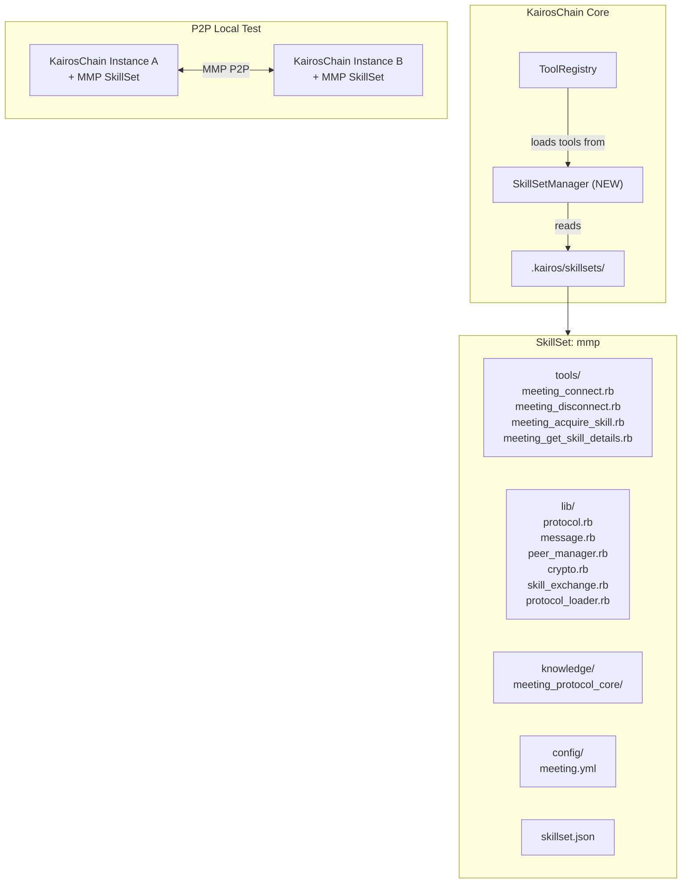
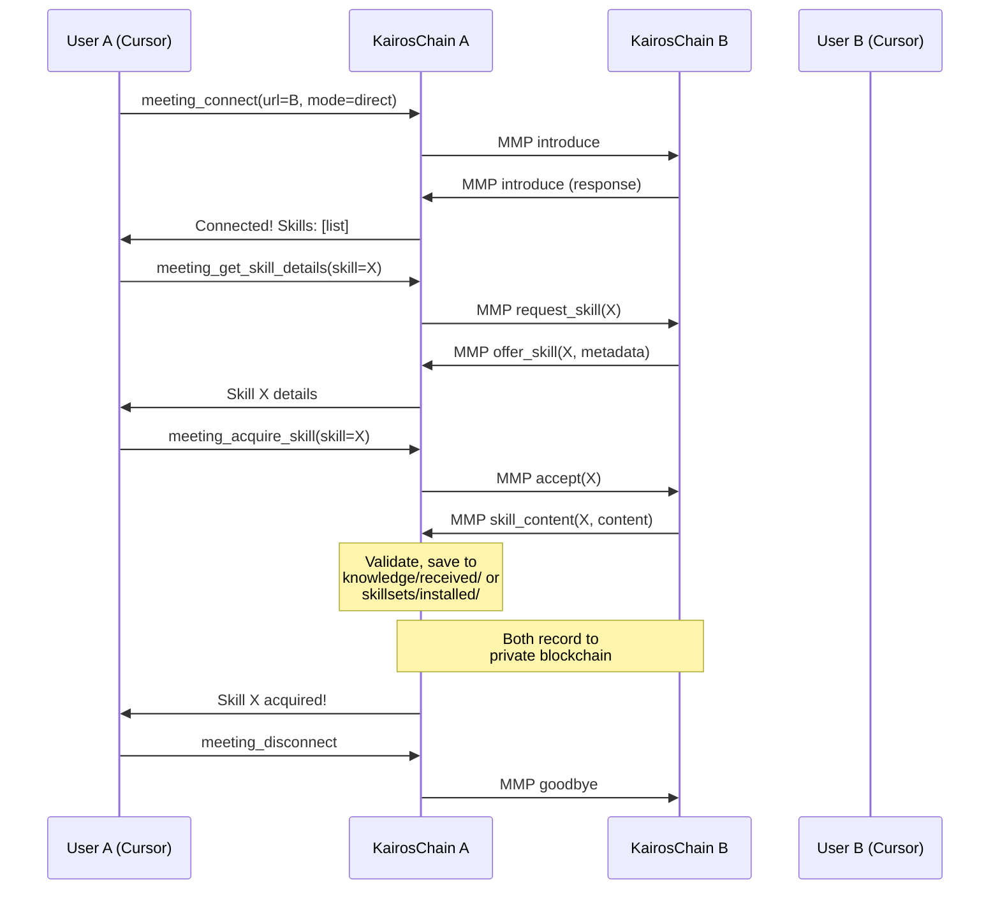

# KairosChain SkillSet Plugin + MMP P2P Exchange

## Branch Strategy

`feature/skillset-plugin` ブランチを `main` から作成して実装を開始する。`feature/meeting-protocol` のMMP関連コードは参考として参照し、必要な部分を新しいSkillSetアーキテクチャに再構成して取り込む。

## Architecture Overview




## Phase 1: SkillSet Plugin Infrastructure

### 1.1 SkillSet Format Definition

`skillset.json` — 各SkillSetのルートに配置するメタデータファイル:

```json
{
  "name": "mmp",
  "version": "1.0.0",
  "description": "Model Meeting Protocol for P2P agent communication",
  "author": "Masaomi Hatakeyama",
  "layer": "L1",
  "depends_on": [],
  "provides": ["p2p_communication", "skill_exchange"],
  "tool_classes": [
    "KairosMcp::SkillSets::MMP::Tools::MeetingConnect",
    "KairosMcp::SkillSets::MMP::Tools::MeetingDisconnect",
    "KairosMcp::SkillSets::MMP::Tools::MeetingAcquireSkill",
    "KairosMcp::SkillSets::MMP::Tools::MeetingGetSkillDetails"
  ],
  "config_files": ["config/meeting.yml"],
  "knowledge_dirs": ["knowledge/meeting_protocol_core"]
}
```

**Layer Model**: SkillSetの `layer` フィールドはデフォルトレイヤーを宣言する。install時にユーザーが `--layer` で上書き可能。レイヤーによって適用されるガバナンスが変わる:

- **L0**: blockchain記録=full, 変更/disable時に人間承認必須
- **L1** (default): blockchain記録=hash_only, 自由にenable/disable
- **L2**: blockchain記録=none, 一時的テスト用

SkillSet自体のデータは常に `.kairos/skillsets/{name}/` 内に独立保持され、既存の `skills/`, `knowledge/`, `context/` とはmergeしない。`KnowledgeProvider` 等はSkillSet内の `knowledge/` を追加スキャン対象として参照するが、物理的なファイル移動は行わない。

SkillSetのディレクトリ構成:

```
.kairos/skillsets/{name}/
  skillset.json         # メタデータ（必須、layer宣言含む）
  tools/                # MCP Tool classes (BaseTool継承)
  lib/                  # 内部ライブラリ
  knowledge/            # knowledge files (レイヤーはskillset.jsonで宣言)
  config/               # 設定ファイルテンプレート
```

### 1.2 SkillSetManager

新規ファイル: [lib/kairos_mcp/skillset_manager.rb](KairosChain_mcp_server/lib/kairos_mcp/skillset_manager.rb)

責務:

- `.kairos/skillsets/` 配下のSkillSetを検出・ロード
- `skillset.json` のパース、依存関係チェック（トポロジカルソート）
- 有効/無効状態とレイヤー割り当ての管理（`.kairos/skillsets/config.yml` に記録）
- SkillSet内の `tools/*.rb` をrequireし、tool_classesを返す
- SkillSet内の `knowledge/` を `KnowledgeProvider` に追加スキャン対象として登録（物理mergeしない）
- レイヤー宣言に基づくガバナンスポリシーの適用（blockchain記録レベル、承認要否）
- SkillSet内の `lib/` をロードパスに追加

### 1.2.1 レイヤー別ガバナンスとデータ統合

SkillSetの `layer` 宣言によって、blockchain記録とRAG(vector search)登録の振る舞いが変わる。これは既存の `LayerRegistry` ([lib/kairos_mcp/layer_registry.rb](KairosChain_mcp_server/lib/kairos_mcp/layer_registry.rb)) と `KnowledgeProvider` ([lib/kairos_mcp/knowledge_provider.rb](KairosChain_mcp_server/lib/kairos_mcp/knowledge_provider.rb)) のパターンに従う。

**Blockchain記録** — 既存の `KnowledgeProvider#record_hash_reference` がL1に対して `hash_only` で記録しているパターンを、SkillSetのレイヤーに応じて適用:

- **L0**: `blockchain: :full` — SkillSetのinstall/enable/disable/update/remove時に、データ全体をblockchainに記録。SkillSet内knowledgeの変更も full record
- **L1**: `blockchain: :hash_only` — SkillSetのinstall/enable/disable/update/remove時に、ハッシュのみをblockchainに記録。SkillSet内knowledgeの変更は hash_only (既存L1と同じ)
- **L2**: `blockchain: :none` — blockchain記録なし。一時的なテスト用

```ruby
# SkillSetManager内
def record_skillset_event(skillset, action, reason: nil)
  blockchain_mode = LayerRegistry.blockchain_mode(skillset.layer)
  return if blockchain_mode == :none

  chain = KairosChain::Chain.new
  record = {
    type: 'skillset_event',
    layer: skillset.layer.to_s,
    skillset_name: skillset.name,
    skillset_version: skillset.version,
    action: action,
    content_hash: skillset.content_hash,
    reason: reason,
    timestamp: Time.now.iso8601
  }

  # L0: full record (include all file hashes)
  if blockchain_mode == :full
    record[:file_hashes] = skillset.all_file_hashes
  end

  chain.add_block([record.to_json])
end
```

**RAG/Vector Search登録** — SkillSet内の `knowledge/` ディレクトリをvector searchインデックスに登録するかどうか:

- **L0**: 登録する。哲学的/メタ的knowledgeも検索対象にすべき
- **L1**: 登録する。既存のL1 knowledgeと同じRAGインデックスに追加
- **L2**: 登録しない（デフォルト）。一時的なので検索ノイズを避ける。ただし `skillset.json` に `"index_knowledge": true` を指定すれば登録可能

`SkillSetManager` がSkillSetをロードする際に、レイヤーに応じて `KnowledgeProvider` にSkillSet内knowledge dirを追加登録する:

```ruby
# SkillSetManager#load_skillset_knowledge
def load_skillset_knowledge(skillset, knowledge_provider)
  return unless skillset.has_knowledge?

  should_index = case skillset.layer
                 when :L0, :L1 then true
                 when :L2 then skillset.config['index_knowledge'] == true
                 else false
                 end

  # KnowledgeProvider に追加スキャンディレクトリとして登録
  knowledge_provider.add_external_dir(
    skillset.knowledge_dir,
    source: "skillset:#{skillset.name}",
    layer: skillset.layer,
    index: should_index
  )
end
```

**KnowledgeProvider の拡張** — 既存ファイル: [lib/kairos_mcp/knowledge_provider.rb](KairosChain_mcp_server/lib/kairos_mcp/knowledge_provider.rb)

`add_external_dir` メソッドを追加。SkillSetや将来の拡張から外部knowledgeディレクトリを登録可能にする:

```ruby
def add_external_dir(dir, source:, layer: :L1, index: true)
  @external_dirs ||= []
  @external_dirs << { dir: dir, source: source, layer: layer, index: index }
end
```

既存の `list`, `get`, `search`, `skill_dirs`, `rebuild_index` メソッドを拡張し、`@external_dirs` も対象に含める。外部dirからのknowledge項目には `source` フィールドを付与して出自を明示。

**LayerRegistry の拡張** — 既存ファイル: [lib/kairos_mcp/layer_registry.rb](KairosChain_mcp_server/lib/kairos_mcp/layer_registry.rb)

SkillSetのレイヤーをクエリ可能にするため、`blockchain_mode` と `requires_blockchain?` が `:L0`, `:L1`, `:L2` シンボルを受け付けるようにする（現在は `L0_constitution`, `L0_law` 等の固定キーのみ）。SkillSetのL0は `L0_law` と同等のガバナンスを適用。

### 1.3 ToolRegistry の拡張

既存ファイル: [lib/kairos_mcp/tool_registry.rb](KairosChain_mcp_server/lib/kairos_mcp/tool_registry.rb)

変更:

- `register_tools` に `register_skillset_tools` を追加
- `register_skillset_tools`: `SkillSetManager` から有効なSkillSetを取得し、各SkillSetの `tool_classes` を順次 `register_if_defined` で登録

```ruby
def register_tools
  # ... existing core tools ...

  # SkillSet-based tools (opt-in plugins)
  register_skillset_tools

  # Skill-based tools (from kairos.rb with tool block)
  register_skill_tools if skill_tools_enabled?
end

def register_skillset_tools
  manager = SkillSetManager.new
  manager.enabled_skillsets.each do |skillset|
    skillset.load!  # require lib/ and tools/
    skillset.tool_classes.each do |cls|
      register_if_defined(cls)
    end
  end
end
```

### 1.4 KairosMcp path helpers の追加

既存ファイル: [lib/kairos_mcp.rb](KairosChain_mcp_server/lib/kairos_mcp.rb)

追加:

```ruby
def skillsets_dir
  path_for('skillsets')
end

def skillsets_config_path
  File.join(skillsets_dir, 'config.yml')
end
```

### 1.5 CLI サブコマンド

既存ファイル: [bin/kairos-chain](KairosChain_mcp_server/bin/kairos-chain)

追加サブコマンド:

- `kairos-chain skillset list` — インストール済みSkillSet一覧（レイヤー表示付き）
- `kairos-chain skillset install <path_or_url> [--layer L0|L1|L2]` — SkillSetをインストール（レイヤー指定可能、デフォルトはskillset.json記載値）
- `kairos-chain skillset enable <name>` — SkillSetを有効化
- `kairos-chain skillset disable <name>` — SkillSetを無効化（L0の場合は人間承認を要求）
- `kairos-chain skillset remove <name>` — SkillSetを削除（L0の場合は人間承認を要求）
- `kairos-chain skillset info <name>` — SkillSetの詳細情報表示（レイヤー、依存関係、tools一覧）

## Phase 2: MMP SkillSet

### 2.1 MMP SkillSetのパッケージング

`feature/meeting-protocol` ブランチから以下のコードをSkillSet構造に再配置:

```
.kairos/skillsets/mmp/
  skillset.json
  tools/
    meeting_connect.rb        # ← feature/meeting-protocol の tools/ から
    meeting_disconnect.rb
    meeting_acquire_skill.rb
    meeting_get_skill_details.rb
  lib/
    mmp.rb                    # エントリポイント
    mmp/
      protocol.rb             # ← meeting/meeting_protocol.rb
      message.rb              # Message Struct 切り出し
      identity.rb             # ← meeting/identity.rb (KairosMcp依存除去)
      peer_manager.rb         # ← meeting/peer_manager.rb
      crypto.rb               # ← meeting/crypto.rb
      skill_exchange.rb       # ← meeting/skill_exchange.rb (ChainAdapter化)
      interaction_log.rb      # ← meeting/interaction_log.rb (ChainAdapter化)
      protocol_loader.rb      # ← meeting/protocol_loader.rb
      protocol_evolution.rb   # ← meeting/protocol_evolution.rb
      compatibility.rb        # ← meeting/compatibility.rb
      place_client.rb         # ← meeting/place_client.rb
      chain_adapter.rb        # NEW: blockchain抽象インターフェース
  knowledge/
    meeting_protocol_core/
      meeting_protocol_core.md   # ← knowledge/ から
    meeting_protocol_discovery/
      meeting_protocol_discovery.md
  config/
    meeting.yml               # ← config/meeting.yml から
```

### 2.2 KairosChain依存の除去

MMP SkillSetのlib/内コードからKairosChain固有コードへの依存を除去:

- `**identity.rb**`: `KairosMcp::VERSION` → `skillset.json` の version を参照、config path → SkillSetのconfig/から読み込み
- `**interaction_log.rb**`: `KairosChain::Chain.new` → `ChainAdapter` インターフェース経由。KairosChainのChainをデフォルトアダプターとして注入
- `**skill_exchange.rb**`: 同上。ChainAdapter経由でblockchain記録

`chain_adapter.rb`:

```ruby
module MMP
  module ChainAdapter
    def record(data)
      raise NotImplementedError
    end

    def history(filter: {})
      raise NotImplementedError
    end
  end

  class KairosChainAdapter
    include ChainAdapter

    def initialize
      require 'kairos_mcp/kairos_chain/chain'
      @chain = KairosMcp::KairosChain::Chain.new
    end

    def record(data)
      @chain.add_block(Array(data).map { |d| d.is_a?(String) ? d : d.to_json })
    end

    def history(filter: {})
      @chain.chain.flat_map { |block| block.data }
    end
  end

  class NullChainAdapter
    include ChainAdapter
    def record(data) = { status: 'skipped' }
    def history(**) = []
  end
end
```

### 2.3 Tools のnamespace調整

各toolをSkillSetのnamespace内に配置:

```ruby
# .kairos/skillsets/mmp/tools/meeting_connect.rb
module KairosMcp
  module SkillSets
    module MMP
      module Tools
        class MeetingConnect < KairosMcp::Tools::BaseTool
          # ... (feature/meeting-protocol の実装を移植)
        end
      end
    end
  end
end
```

### 2.4 P2P Direct Mode の実装

`feature/meeting-protocol` では relay mode（Meeting Place経由）が中心だったが、Phase 2ではMeeting Place不要のP2P direct modeを優先実装:

- Agent AがHTTP serverを起動（既存の `--http` フラグ活用）
- Agent BがAgent AのURLを直接指定して接続
- `meeting_connect(url: "http://localhost:8081", mode: "direct")` で接続
- MMP protocolでintroduce → skill exchange → disconnect

P2P通信はKairosChainのStreamable HTTP Transport ([lib/kairos_mcp/transport/http_server.rb](KairosChain_mcp_server/lib/kairos_mcp/transport/http_server.rb)) 上にMMP endpointsを追加する形で実装。

### 2.5 SkillSet交換のフロー




## Phase 2.5: P2P Local Test

### テストスクリプト

新規ファイル: `test_p2p_skillset_exchange.rb`

カスタムスクリプトスタイル（既存のtest_meeting.rb拡張パターン）で以下をテスト:

1. **SkillSet Plugin基盤テスト**
  - SkillSetManagerがskillsets/を検出できる
  - skillset.jsonのパース・バリデーション
  - 依存関係の解決
  - ToolRegistryへの動的登録
  - enable/disable切り替え
2. **MMP SkillSetロードテスト**
  - MMP SkillSetのtoolsが正しく登録される
  - tools/listにmeeting_*が出現する
  - MMP SkillSet無効時にはmeeting_*が出現しない
3. **P2P通信テスト**
  - 2つのKairosChainインスタンスをローカルで起動（異なるport、異なるdata_dir）
  - Instance A → Instance B に接続（direct mode）
  - introduce交換
  - skill一覧の取得
  - skill詳細の取得
  - skill交換の実行
  - 受信skillの検証・保存確認
  - provenance（来歴）がblockchainに記録されていることの確認
  - disconnect
4. **SkillSet統合テスト**
  - 受け取ったSkillSetをinstall可能か
  - installしたSkillSetのtoolsが登録されるか
  - disableで非表示になるか

テスト実行方法:

```bash
# 前提: 2つの一時data dirを作成
ruby test_p2p_skillset_exchange.rb
```

## Phase 3: SkillSet Exchange Minimal

### Background

Phase 2.5完了時点で個別Skill（Markdownファイル）の交換のみ可能だったが、SkillSet単位での交換手段がなかった。Phase 3では knowledge-only SkillSet に限定した安全な SkillSet 交換を実装。

### 3A: SkillSetManager のパッケージング拡張

**Skillset クラス拡張** — [lib/kairos_mcp/skillset.rb](KairosChain_mcp_server/lib/kairos_mcp/skillset.rb):

- `knowledge_only?`: `tools/` と `lib/` に `.rb` ファイルがないことを判定
- `exchangeable?`: `knowledge_only? && valid?`
- `file_list`: SkillSet内全ファイルの相対パスリスト

**SkillSetManager 拡張** — [lib/kairos_mcp/skillset_manager.rb](KairosChain_mcp_server/lib/kairos_mcp/skillset_manager.rb):

- `package(name)`: knowledge-only SkillSetをtar.gz→Base64 JSONにパッケージング
- `install_from_archive(archive_data)`: Base64 JSONアーカイブからSkillSetをインストール
  - content_hash検証、knowledge-only制約チェック、重複インストール防止
- `rubygems/package` + `zlib` を使用（外部依存なし）

**CLI 拡張** — [bin/kairos-chain](KairosChain_mcp_server/bin/kairos-chain):

- `kairos-chain skillset package <name>` — JSON archiveをstdoutに出力
- `kairos-chain skillset install-archive <file|->` — アーカイブからインストール

### 3B: MMP P2P SkillSet交換エンドポイント

**MeetingRouter 拡張** — [lib/kairos_mcp/meeting_router.rb](KairosChain_mcp_server/lib/kairos_mcp/meeting_router.rb):

- `GET /meeting/v1/skillsets` — 交換可能なSkillSet一覧
- `GET /meeting/v1/skillset_details?name=xxx` — SkillSet詳細情報
- `POST /meeting/v1/skillset_content` — SkillSetアーカイブの送信

**MMP Identity 拡張** — [templates/skillsets/mmp/lib/mmp/identity.rb](KairosChain_mcp_server/templates/skillsets/mmp/lib/mmp/identity.rb):

- `introduce` に `exchangeable_skillsets` フィールドを追加

**Protocol Extension** — NEW: `templates/skillsets/mmp/knowledge/meeting_protocol_skillset_exchange/meeting_protocol_skillset_exchange.md`

- `offer_skillset`, `request_skillset`, `skillset_content`, `list_skillsets` アクション定義

**Config 更新** — [templates/skillsets/mmp/config/meeting.yml](KairosChain_mcp_server/templates/skillsets/mmp/config/meeting.yml):

- `skillset_exchange` セクション追加 (`enabled`, `knowledge_only`, `auto_install`)

**skillset.json 更新** — `provides` に `skillset_exchange` 追加、`knowledge_dirs` に新プロトコル拡張追加

### 3C: テスト (Section 5)

**test_p2p_skillset_exchange.rb** に Section 5 (42 assertions) を追加:

1. knowledge-only SkillSet の作成・判定テスト
2. MMP (executable) の packaging 拒否テスト
3. `GET /meeting/v1/skillsets` エンドポイントテスト
4. `GET /meeting/v1/skillset_details` エンドポイントテスト
5. `POST /meeting/v1/skillset_content` アーカイブ取得テスト
6. Agent B での `install_from_archive` テスト
7. content_hash一致、ファイル内容一致の検証
8. executable archive のインストール拒否テスト
9. `introduce` の `exchangeable_skillsets` フィールドテスト
10. 重複インストール拒否テスト

**テスト結果: 114 passed, 0 failed** (既存72 + 新規42)

## Scope Boundary (ここで一旦停止)

Phase 3C 完了時点で以下が動作確認可能:

- KairosChainのSkillSet plugin機構
- MMP SkillSetのinstall/enable/disable
- KairosChain P2P direct modeでの個別skill交換
- knowledge-only SkillSetのパッケージング/アンパッケージング
- MMP P2P エンドポイント経由でのSkillSet一覧取得・詳細取得・アーカイブ交換
- 受信SkillSetのcontent_hash検証とインストール
- tools/lib含むSkillSetの交換ブロック（セキュリティ）
- Blockchain provenance記録

以下は**次フェーズ** (別プラン):

- HestiaChain SkillSet
- Meeting Place Server経由のSkillSet交換
- Meeting Place間通信
- Public chain anchoring

## Files to Create/Modify Summary

**New files (Phase 1-2):**

- `lib/kairos_mcp/skillset_manager.rb` — SkillSet管理コア
- `lib/kairos_mcp/skillset.rb` — SkillSetクラス（個別SkillSet表現）
- `lib/kairos_mcp/meeting_router.rb` — MMP P2Pエンドポイントルーター
- `templates/skillsets/mmp/` — MMP SkillSet一式（上記2.1の構成）
- `test_p2p_skillset_exchange.rb` — P2Pテストスクリプト

**New files (Phase 3):**

- `templates/skillsets/mmp/knowledge/meeting_protocol_skillset_exchange/meeting_protocol_skillset_exchange.md` — SkillSet交換Protocol Extension

**Modified files (Phase 1-2):**

- `lib/kairos_mcp.rb` — skillsets_dir等のpath helpers追加
- `lib/kairos_mcp/tool_registry.rb` — register_skillset_tools追加
- `lib/kairos_mcp/knowledge_provider.rb` — add_external_dir追加、外部dir対応に拡張
- `lib/kairos_mcp/layer_registry.rb` — SkillSetレイヤー(:L0/:L1/:L2)をクエリ可能に拡張
- `bin/kairos-chain` — skillsetサブコマンド追加

**Modified files (Phase 3):**

- `lib/kairos_mcp/skillset.rb` — knowledge_only?, exchangeable?, file_list 追加
- `lib/kairos_mcp/skillset_manager.rb` — package, install_from_archive, tar.gz helpers 追加
- `lib/kairos_mcp/meeting_router.rb` — SkillSet交換エンドポイント3つ追加
- `templates/skillsets/mmp/lib/mmp/identity.rb` — exchangeable_skillsets 追加
- `templates/skillsets/mmp/config/meeting.yml` — skillset_exchange セクション追加
- `templates/skillsets/mmp/skillset.json` — provides, knowledge_dirs 更新
- `bin/kairos-chain` — package, install-archive サブコマンド追加
- `test_p2p_skillset_exchange.rb` — Section 5 追加

**Referenced from feature/meeting-protocol (移植・再構成):**

- `lib/kairos_mcp/meeting/*.rb` → `templates/skillsets/mmp/lib/mmp/`
- `lib/kairos_mcp/tools/meeting_*.rb` → `templates/skillsets/mmp/tools/`
- `knowledge/meeting_protocol`_* → `templates/skillsets/mmp/knowledge/`
- `config/meeting.yml` → `templates/skillsets/mmp/config/`

